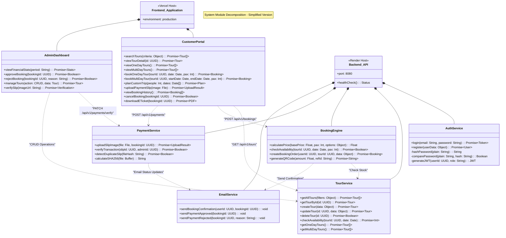
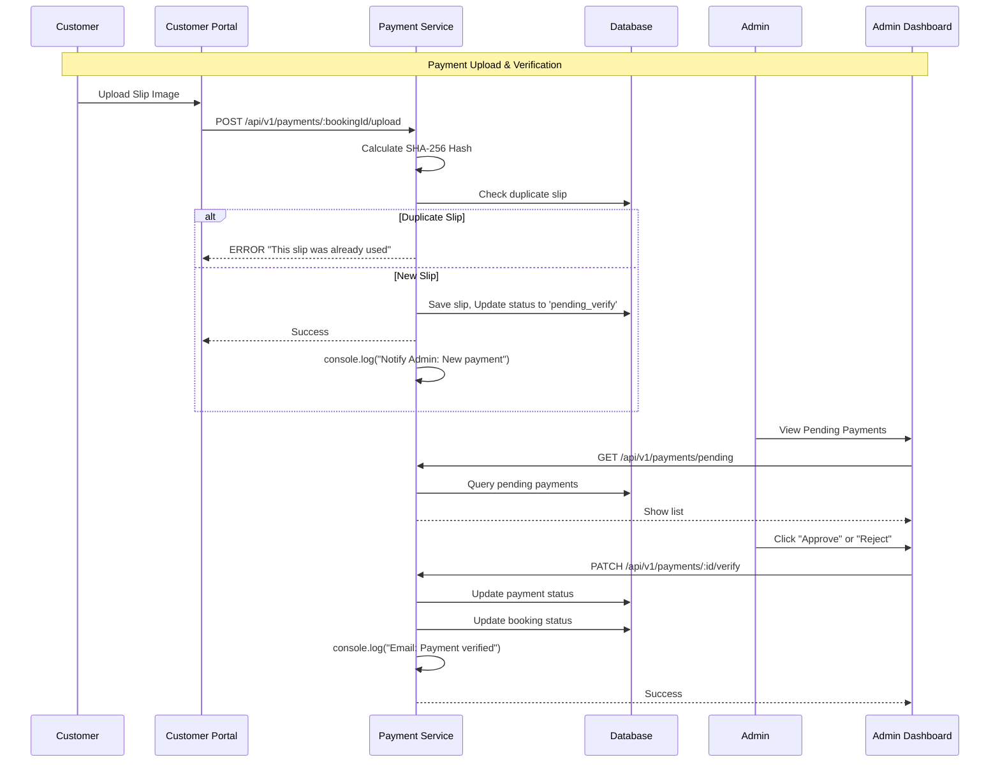

# System Component Design - Simplified (Thai Tour Website)

> เอกสารนี้แสดงการออกแบบส่วนประกอบระบบแบบ **Simplified** ที่เหมาะสำหรับนักศึกษาปี 1

---

## Overview

**Removed from original design:**
- ❌ CacheService (Redis) → In-memory cache or none
- ❌ LoggerService (Winston) → console.log()
- ❌ NotificationService (Email Queue) → console.log()
- ❌ Session management → JWT only (stateless)

---

## 1. Module Decomposition (Simplified)



---

## 2. API Endpoint Specification

### 2.1 Authentication Endpoints

| Method | Endpoint | Description | Auth Required |
|---|---|---|---|
| POST | `/api/v1/auth/register` | Create new user account | ❌ |
| POST | `/api/v1/auth/login` | Login with email/password | ❌ |

**Request Example:**

```json
POST /api/v1/auth/login
{
  "email": "customer@example.com",
  "password": "SecurePass123!"
}
```

**Response:**

```json
{
  "success": true,
  "data": {
    "token": "eyJhbGciOiJIUzI1NiIsInR5cCI6IkpXVCJ9...",
    "user": {
      "id": "uuid-1234",
      "email": "customer@example.com",
      "role": "customer"
    }
  }
}
```

---

### 2.2 Tour Management Endpoints

| Method | Endpoint | Description | Auth Required |
|---|---|---|---|
| GET | `/api/v1/tours` | List all tours (with filters) | ❌ |
| GET | `/api/v1/tours/one-day` | List one-day trips only | ❌ |
| GET | `/api/v1/tours/multi-day` | List multi-day packages only | ❌ |
| GET | `/api/v1/tours/:id` | Get tour details | ❌ |
| POST | `/api/v1/tours` | Create new tour | ✅ Admin |
| PATCH | `/api/v1/tours/:id` | Update tour | ✅ Admin |
| DELETE | `/api/v1/tours/:id` | Soft delete tour | ✅ Admin |

**Query Parameters Example:**

```
GET /api/v1/tours?region=south&category=adventure&minPrice=1000&maxPrice=5000&tour_type=multi_day
```

---

### 2.3 Booking Endpoints

| Method | Endpoint | Description | Auth Required |
|---|---|---|---|
| POST | `/api/v1/bookings` | Create new booking | ✅ Customer |
| GET | `/api/v1/bookings/:id` | Get booking details | ✅ Owner/Admin |
| GET | `/api/v1/bookings/my-bookings` | List user's bookings | ✅ Customer |
| PATCH | `/api/v1/bookings/:id/cancel` | Cancel booking | ✅ Owner |
| POST | `/api/v1/bookings/calculate` | Calculate trip price | ✅ Customer |

---

### 2.4 Payment Endpoints

| Method | Endpoint | Description | Auth Required |
|---|---|---|---|
| POST | `/api/v1/payments/:bookingId/upload` | Upload payment slip | ✅ Customer |
| PATCH | `/api/v1/payments/:id/verify` | Verify payment (approve/reject) | ✅ Admin |
| GET | `/api/v1/payments/pending` | List pending verifications | ✅ Admin |

---

## 3. Email Service (Simplified)

```typescript
@Injectable()
export class EmailService {
  // Simplified: Just use console.log() instead of real email
  sendBookingConfirmation(userId: string, bookingId: string) {
    console.log('=================================');
    console.log('📧 EMAIL: Booking Confirmation');
    console.log(`To: User ID: ${userId}`);
    console.log(`Booking ID: ${bookingId}`);
    console.log('Message: Your booking has been confirmed. Please pay within 24 hours.');
    console.log('=================================');
  }

  sendPaymentApproved(bookingId: string) {
    console.log('=================================');
    console.log('📧 EMAIL: Payment Approved');
    console.log(`Booking ID: ${bookingId}`);
    console.log('Message: Your payment has been approved. E-Ticket is ready.');
    console.log('=================================');
  }

  sendPaymentRejected(bookingId: string, reason: string) {
    console.log('=================================');
    console.log('📧 EMAIL: Payment Rejected');
    console.log(`Booking ID: ${bookingId}`);
    console.log(`Reason: ${reason}`);
    console.log('Message: Please re-upload your payment slip.');
    console.log('=================================');
  }
}
```

---

## 4. Payment Verification Flow (Simplified)



---

## 5. Error Handling

### Standard Response Format

**Success Response:**

```json
{
  "success": true,
  "data": { ... },
  "message": "Operation completed successfully"
}
```

**Error Response:**

```json
{
  "success": false,
  "error": {
    "code": "BOOKING_STOCK_INSUFFICIENT",
    "message": "This tour is fully booked"
  }
}
```

---

## 6. Summary of Simplifications

| Original (Complex) | Simplified |
|---|---|
| 8 Services | 5 Services |
| CacheService (Redis) | In-memory or none |
| LoggerService (Winston) | console.log() |
| NotificationService (Email Queue) | console.log() |
| Session table | JWT only (stateless) |
| RateLimiter (Advanced) | @nestjs/throttler or none |

---

**Last Updated:** 2026-02-10
**Status:** Simplified for Year 1 Students 🚀
