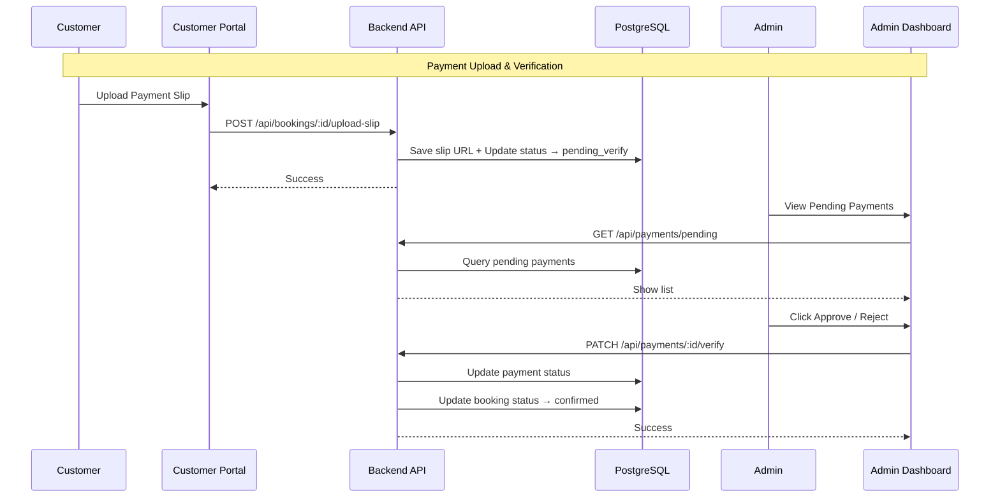

# System Component Design — Thai Tour Website

> เอกสารนี้แสดงการออกแบบส่วนประกอบระบบตามโค้ดจริงในโปรเจกปัจจุบัน

---

## 1. Module Decomposition

```mermaid
classDiagram
    note "NestJS Backend Module Structure"

    %% ========== Frontend Layer ==========
    class Frontend_Application {
        <<Vite Dev Server : 5173>>
        +environment: development
    }

    class CustomerPortal {
        +searchTours(filters): Promise~Tour[]~
        +viewTourDetail(id: UUID): Promise~Tour~
        +viewRecommendedTours(): Promise~Tour[]~
        +bookTour(tourId, scheduleId, pax, contact): Promise~Booking~
        +calculatePrice(tourId, adults, children): Promise~PriceResult~
        +uploadPaymentSlip(bookingId, file): Promise~Result~
        +viewBookingHistory(): Promise~Booking[]~
        +cancelBooking(bookingId): Promise~Boolean~
        +writeReview(bookingId, rating, comment): Promise~Review~
        +submitContactTicket(data): Promise~Ticket~
        +viewProfile(): Promise~User~
        +updateProfile(data): Promise~User~
        +uploadAvatar(file): Promise~Result~
    }

    class AdminDashboard {
        +viewDashboardStats(): Promise~Stats~
        +manageBookings(action, bookingId): Promise~Boolean~
        +verifyPayment(paymentId, status): Promise~Boolean~
        +manageTours(action: CRUD, data): Promise~Tour~
        +manageTourSchedules(tourId, action): Promise~Schedule~
        +manageUsers(action: CRUD): Promise~User~
        +manageReviews(action: CRUD): Promise~Review~
        +manageTickets(id, status): Promise~Ticket~
    }

    %% ========== Backend Layer ==========
    class Backend_API {
        <<NestJS : 3000>>
        +port: 3000
    }

    class AuthService {
        +signUp(username, password, email?): Promise~User~
        +signIn(username, password): Promise~Token~
        +googleLogin(profile): Promise~Token~
        +forgotPassword(email): Promise~void~
        +verifyOtp(email, otp): Promise~Token~
        +resetPasswordWithToken(token, newPassword): Promise~void~
    }

    class UsersService {
        +findOne(username): Promise~User~
        +findAll(): Promise~User[]~
        +updateCurrentUserProfile(id, data): Promise~User~
        +updateAvatar(id, file): Promise~User~
        +create(data): Promise~User~
        +remove(id): Promise~void~
    }

    class ToursService {
        +getTours(filters): Promise~Tour[]~
        +getRecommendedTours(): Promise~Tour[]~
        +getTourById(id): Promise~Tour~
        +create(data, images): Promise~Tour~
        +update(id, data, images): Promise~Tour~
        +remove(id): Promise~void~
    }

    class TourSchedulesService {
        +findAll(tourId): Promise~Schedule[]~
        +findAvailableByTour(tourId): Promise~Schedule[]~
        +create(tourId, data): Promise~Schedule~
        +update(id, data): Promise~Schedule~
        +remove(id): Promise~void~
    }

    class BookingsService {
        +create(userId, dto): Promise~Booking~
        +calculatePrice(dto): Promise~PriceResult~
        +findAllByUser(userId): Promise~Booking[]~
        +findOneById(id): Promise~Booking~
        +cancelBooking(id, userId): Promise~Booking~
        +uploadPaymentSlip(id, file): Promise~Booking~
        +expirePayments(): void — Cron
    }

    class PaymentsService {
        +generateQrCode(bookingId): Promise~QR~
        +findPending(): Promise~Payment[]~
        +verifyPayment(id, status): Promise~Payment~
        +checkStatus(id): Promise~Payment~
    }

    class ReviewsService {
        +create(userId, dto): Promise~Review~
        +findByTour(tourId, page): Promise~Review[]~
        +findRecommended(limit): Promise~Review[]~
        +findForAdmin(filters): Promise~Review[]~
        +updateByAdmin(id, dto): Promise~Review~
        +refreshTourRating(tourId): Promise~void~
    }

    class TicketsService {
        +createTicket(dto): Promise~Ticket~
        +findAll(): Promise~Ticket[]~
        +updateStatus(id, status): Promise~Ticket~
    }

    class AdminService {
        +getDashboardStats(): Promise~Stats~
        +getAllBookings(): Promise~Booking[]~
        +deleteBooking(id): Promise~void~
        +updateBookingStatus(id, status): Promise~Booking~
    }

    %% ========== Relationships ==========
    Frontend_Application *-- CustomerPortal
    Frontend_Application *-- AdminDashboard

    Backend_API *-- AuthService
    Backend_API *-- UsersService
    Backend_API *-- ToursService
    Backend_API *-- TourSchedulesService
    Backend_API *-- BookingsService
    Backend_API *-- PaymentsService
    Backend_API *-- ReviewsService
    Backend_API *-- TicketsService
    Backend_API *-- AdminService

    CustomerPortal ..> ToursService : "GET /api/tours"
    CustomerPortal ..> BookingsService : "POST /api/bookings"
    CustomerPortal ..> PaymentsService : "GET /api/payments/qr/:id"
    CustomerPortal ..> ReviewsService : "POST /api/reviews"
    CustomerPortal ..> TicketsService : "POST /api/tickets"
    CustomerPortal ..> UsersService : "GET /api/users/me"

    AdminDashboard ..> AdminService : "GET /api/admin/stats"
    AdminDashboard ..> PaymentsService : "PATCH /api/payments/:id/verify"
    AdminDashboard ..> ToursService : "CRUD /api/tours"
    AdminDashboard ..> TourSchedulesService : "CRUD /api/tours/:id/schedules"
    AdminDashboard ..> UsersService : "GET /api/users"
    AdminDashboard ..> ReviewsService : "GET /api/reviews/admin"
    AdminDashboard ..> TicketsService : "PATCH /api/tickets/:id"

    BookingsService ..> ToursService : "Check availability"
    BookingsService ..> PaymentsService : "Create payment"
    ReviewsService ..> ToursService : "Refresh rating"
```

---

## 2. API Endpoint Specification

### 2.1 Authentication Endpoints (`api/auth`)

| Method | Endpoint | Description | Auth |
|---|---|---|---|
| POST | `/api/auth/signup` | สมัครสมาชิก (username + password) | - |
| POST | `/api/auth/signin` | เข้าสู่ระบบ → JWT token | - |
| GET | `/api/auth/google` | เข้าสู่ระบบผ่าน Google OAuth | - |
| GET | `/api/auth/google/callback` | Google OAuth callback → redirect พร้อม token | - |
| GET | `/api/auth/profile` | ดูโปรไฟล์ (จาก JWT) | JWT |
| POST | `/api/auth/forgot-password` | ส่ง OTP ไปอีเมล | - |
| POST | `/api/auth/verify-otp` | ตรวจสอบ OTP → ได้ reset token | - |
| POST | `/api/auth/reset-password` | รีเซ็ตรหัสผ่านด้วย token | - |

**Sign In — Request / Response:**

```json
POST /api/auth/signin
{
  "username": "customer1",
  "password": "SecurePass123!"
}
→ {
  "accessToken": "eyJhbGciOiJIUzI1NiIsInR5cCI6IkpXVCJ9..."
}
```

---

### 2.2 User Endpoints (`api/users`)

| Method | Endpoint | Description | Auth |
|---|---|---|---|
| GET | `/api/users/me` | ดูโปรไฟล์ตัวเอง | JWT |
| PATCH | `/api/users/me` | แก้ไขโปรไฟล์ | JWT |
| POST | `/api/users/me/avatar` | อัปโหลดรูปโปรไฟล์ (2MB, PNG/JPG) | JWT |
| POST | `/api/users` | สร้าง user ใหม่ (admin) | JWT + Admin |
| GET | `/api/users` | ดูรายชื่อ user ทั้งหมด | JWT + Admin |
| GET | `/api/users/:id` | ดูข้อมูล user | JWT + Admin |
| PATCH | `/api/users/:id` | แก้ไข user | JWT + Admin |
| DELETE | `/api/users/:id` | ลบ user | JWT + Admin |

---

### 2.3 Tour Endpoints (`api/tours`)

| Method | Endpoint | Description | Auth |
|---|---|---|---|
| GET | `/api/tours` | ค้นหาทัวร์ (search, region, category, price, duration, sort) | - |
| GET | `/api/tours/recommended` | ทัวร์แนะนำ (6 รายการ) | - |
| GET | `/api/tours/:id` | รายละเอียดทัวร์ | - |
| POST | `/api/tours` | สร้างทัวร์ใหม่ (พร้อมรูป) | JWT + Admin |
| PATCH | `/api/tours/:id` | แก้ไขทัวร์ | JWT + Admin |
| DELETE | `/api/tours/:id` | ลบทัวร์ | JWT + Admin |
| POST | `/api/tours/seed` | Seed ข้อมูลทดสอบ | - |

**Tour Schedules (nested under tour):**

| Method | Endpoint | Description | Auth |
|---|---|---|---|
| GET | `/api/tours/:tourId/schedules` | ดู schedule ทั้งหมด | - |
| GET | `/api/tours/:tourId/schedules/available` | ดู schedule ที่ว่าง | - |
| GET | `/api/tours/:tourId/schedules/:id` | รายละเอียด schedule | - |
| POST | `/api/tours/:tourId/schedules` | สร้าง schedule | JWT + Admin |
| PATCH | `/api/tours/:tourId/schedules/:id` | แก้ไข schedule | JWT + Admin |
| DELETE | `/api/tours/:tourId/schedules/:id` | ลบ schedule | JWT + Admin |

---

### 2.4 Booking Endpoints (`api/bookings`)

| Method | Endpoint | Description | Auth |
|---|---|---|---|
| POST | `/api/bookings/calculate` | คำนวณราคา (adults, children, discount) | - |
| POST | `/api/bookings` | สร้าง booking (transaction + lock) | JWT |
| GET | `/api/bookings/my-bookings` | Booking ของ user | JWT |
| GET | `/api/bookings/:id` | รายละเอียด booking | JWT |
| PATCH | `/api/bookings/:id/cancel` | ยกเลิก booking | JWT |
| POST | `/api/bookings/:id/upload-slip` | อัปโหลดสลิป (5MB) | JWT |

---

### 2.5 Payment Endpoints (`api/payments`)

| Method | Endpoint | Description | Auth |
|---|---|---|---|
| GET | `/api/payments/qr/:id` | สร้าง PromptPay QR Code | JWT |
| GET | `/api/payments/pending` | รายการรอตรวจสอบ | JWT + Admin |
| PATCH | `/api/payments/:id/verify` | ยืนยัน/ปฏิเสธการชำระ | JWT + Admin |
| POST | `/api/payments/webhook` | Webhook รับแจ้งจากธนาคาร | - |
| GET | `/api/payments/:id/status` | ตรวจสอบสถานะ | JWT |

---

### 2.6 Review Endpoints (`api/reviews`)

| Method | Endpoint | Description | Auth |
|---|---|---|---|
| POST | `/api/reviews` | เขียนรีวิว (ต้องมี confirmed booking) | JWT |
| GET | `/api/reviews/recommended` | รีวิวแนะนำ | - |
| GET | `/api/reviews/tour/:tourId` | รีวิวของทัวร์ (pagination) | - |
| GET | `/api/reviews/admin` | รีวิวทั้งหมด (admin, search, filter) | JWT + Admin |
| PATCH | `/api/reviews/admin/:id` | แก้ไขรีวิว (admin) | JWT + Admin |

---

### 2.7 Ticket Endpoints (`api/tickets`)

| Method | Endpoint | Description | Auth |
|---|---|---|---|
| POST | `/api/tickets` | ส่งข้อความติดต่อ | - |
| GET | `/api/tickets` | ดูรายการทั้งหมด | - |
| PATCH | `/api/tickets/:id` | อัปเดตสถานะ | - |

---

### 2.8 Admin Endpoints (`api/admin`)

| Method | Endpoint | Description | Auth |
|---|---|---|---|
| GET | `/api/admin/stats` | สถิติ Dashboard | JWT + Admin |
| GET | `/api/admin/bookings` | Booking ทั้งหมด (with relations) | JWT + Admin |
| DELETE | `/api/admin/bookings/:id` | ลบ booking | JWT + Admin |
| PATCH | `/api/admin/bookings/:id/status` | เปลี่ยนสถานะ booking | JWT + Admin |

---

## 3. Payment Verification Flow


```mermaid
sequenceDiagram
    participant Customer
    participant UI as Customer Portal
    participant API as Backend API
    participant DB as PostgreSQL
    participant Admin
    participant Dashboard as Admin Dashboard

    Note over Customer, Dashboard: Payment Upload & Verification

    Customer->>UI: Upload Payment Slip
    UI->>API: POST /api/bookings/:id/upload-slip

    API->>DB: Save slip URL + Update status → pending_verify
    API-->>UI: Success

    Admin->>Dashboard: View Pending Payments
    Dashboard->>API: GET /api/payments/pending
    API->>DB: Query pending payments
    API-->>Dashboard: Show list

    Admin->>Dashboard: Click Approve / Reject
    Dashboard->>API: PATCH /api/payments/:id/verify

    API->>DB: Update payment status
    API->>DB: Update booking status → confirmed
    API-->>Dashboard: Success
```

---

## 4. Frontend Page Structure

### Public Pages
| Route | Component | Description |
|---|---|---|
| `/` | HomePage | หน้าแรก + ทัวร์แนะนำ + รีวิว |
| `/tours` | ToursPage | ค้นหา/กรองทัวร์ |
| `/tours/:id` | TourDetailPage | รายละเอียด + จอง |
| `/login` | loginpage | เข้าสู่ระบบ |
| `/login/success` | LoginSuccess | Google OAuth callback |
| `/register` | RegisterPage | สมัครสมาชิก |
| `/payment/:id` | PaymentPage | QR Code + อัปโหลดสลิป |
| `/booking-history` | BookingHistoryPage | ประวัติการจอง |
| `/profile` | ProfilePage | โปรไฟล์ + แก้ไข |
| `/contact` | ContactPage | ฟอร์มติดต่อ |
| `/about` | AboutUsPage | เกี่ยวกับเรา |

### Admin Pages (ผ่าน AdminGuard)
| Route | Component | Description |
|---|---|---|
| `/admin` | AdminDashboard | สถิติภาพรวม |
| `/admin/tours` | TourManager | จัดการทัวร์ CRUD |
| `/admin/schedules` | TourScheduleManager | จัดการตารางทัวร์ |
| `/admin/users` | UserManager | จัดการผู้ใช้ |
| `/admin/bookings` | BookingHistory | จัดการการจอง |
| `/admin/tickets` | TicketManager | ข้อความติดต่อ |
| `/admin/reviews` | ReviewManager | จัดการรีวิว |

---

## 5. Error Handling

NestJS built-in HTTP exceptions:

| Exception | When |
|---|---|
| `NotFoundException` | ไม่พบ resource (tour, booking, user) |
| `BadRequestException` | Input ไม่ถูกต้อง, ที่นั่งไม่พอ |
| `UnauthorizedException` | Token หมดอายุ / ไม่มี token |
| `ForbiddenException` | ไม่มี permission (ไม่ใช่ admin) |
| `ConflictException` | Duplicate (เช่น username ซ้ำ) |

---

**Last Updated:** 2026-03-06
**Status:** สอดคล้องกับโค้ดปัจจุบัน
