# Database Design - Simplified (Thai Tour Website)

> เอกสารนี้แสดงโครงสร้างฐานข้อมูลแบบ **Simplified** ที่เหมาะสำหรับนักศึกษาปี 1

---

## Overview

```
Database Tables (4 tables only):
├── users
├── tours
├── bookings
└── payments
```

**Removed from original design:**

- ❌ SESSIONS table → JWT only (stateless)
- ❌ AUDIT_LOGS table → console.log() instead
- ❌ EMAIL_QUEUE table → console.log() instead
- ❌ PASSWORD_RESETS table → Admin reset password instead
- ❌ Row Level Security (RLS) → NestJS Guards instead
- ❌ Full-text search index → LIKE/ILIKE instead
- ❌ Materialized views → Simple views instead

**Delta (ต้องเพิ่มให้ตรงความต้องการปัจจุบัน):**

- เพิ่มตาราง `tour_schedules` (tour_id, available_date, max_capacity_override, is_available) สำหรับ slot ต่อวัน
- เพิ่มตาราง `reviews` (tour_id, user_id, booking_id, rating, comment) และ index tour_id/user_id
- เพิ่มคอลัมน์ใน `tours`: `is_featured`, `average_rating`, `review_count`
- เพิ่ม view `tour_date_availability` (หรือใช้ JOIN bookings เพื่อนับที่ว่างต่อวัน)

---

## 1. Entity-Relationship Diagram (Simplified)

```mermaid
erDiagram
    %% ========== User Management ==========
    USERS {
        uuid id PK "User ID (UUID)"
        string email UK "Login Email - Unique"
        string password_hash "bcrypt Hash (cost=12)"
        string full_name "Display Name"
        string phone_number "Contact Number (nullable)"
        enum role "admin | customer - Default: customer"
        datetime created_at "Registration Date"
        datetime updated_at "Last Update"
    }

    %% ========== Reviews ==========
    REVIEWS {
        uuid id PK "Review ID"
        uuid user_id FK "Ref: USERS.id"
        uuid tour_id FK "Ref: TOURS.id"
        uuid booking_id FK "Ref: BOOKINGS.id (unique)"
        int rating "1-5"
        text comment "Optional"
        datetime created_at "Created"
        datetime updated_at "Updated"
    }

    %% ========== Tour Management ==========
    TOURS {
        uuid id PK "Tour ID (UUID)"
        string title "Tour Name - NOT NULL"
        text description "Detailed Description"
        text itinerary "รายการท่องเที่ยว (Itinerary Details)"
        decimal base_price "Price per Person (THB)"
        string region "North | South | Central | East | West | Northeast"
        string category "Adventure | Relax | Culture | Food | Beach"
        string tour_type "one_day | multi_day - Default: one_day"
        int duration_days "จำนวนวัน (Number of Days) - Default: 1"
        text transportation "วิธีการเดินทาง (Transportation Method)"
        text accommodation "ที่พัก (Accommodation Details) - for multi-day tours"
        int max_capacity "Total Available Seats"
        string image_url "Cover Image URL"
        string[] additional_images "Gallery Images Array"
        boolean is_active "Show/Hide Status - Default: true"
        boolean is_featured "Featured Tour - Default: false"
        decimal average_rating "Cached avg rating"
        int review_count "Number of reviews"
        json options "Optional Add-ons"
        datetime created_at "Creation Date"
        datetime updated_at "Last Modified Date"
    }

    %% ========== Tour Schedules ==========
    TOUR_SCHEDULES {
        uuid id PK "Schedule ID"
        uuid tour_id FK "Ref: TOURS.id"
        date available_date "Date open for booking"
        int max_capacity_override "Nullable override"
        boolean is_available "Open flag - Default: true"
        datetime created_at "Created"
    }

    %% ========== Booking System ==========
    BOOKINGS {
        uuid id PK "Booking ID (UUID)"
        uuid user_id FK "Ref: USERS.id"
        uuid tour_id FK "Ref: TOURS.id"
        int pax "Number of People"
        decimal total_price "Final Calculated Price"
        date travel_date "Selected Travel Date (for one-day tours)"
        date start_date "วันเริ่มต้น (Start Date - for multi-day tours)"
        date end_date "วันสิ้นสุด (End Date - for multi-day tours)"
        json selected_options "Chosen Add-ons"
        enum status "pending_pay | pending_verify | confirmed | cancelled | expired"
        datetime payment_deadline "Auto-cancel time (created_at + 24h)"
        datetime created_at "Booking Timestamp"
        datetime updated_at "Last Status Change"
    }

    %% ========== Payment & Transactions ==========
    PAYMENTS {
        uuid id PK "Transaction ID"
        uuid booking_id FK "Ref: BOOKINGS.id - Unique"
        string slip_url "Slip Image Path"
        string slip_hash "SHA-256 Hash - Unique (duplicate detection)"
        decimal amount "Paid Amount"
        datetime uploaded_at "Upload Timestamp"
        enum status "waiting | pending_verify | approved | rejected"
        uuid verified_by FK "Ref: USERS.id (Admin) - nullable"
        datetime verified_at "Verification Timestamp"
        text reject_reason "Reason if rejected"
        datetime created_at "Payment Record Creation"
    }

    %% ========== Relationships ==========
    USERS ||--o{ BOOKINGS : "1 booking belongs to 1 user"
    USERS ||--o{ PAYMENTS : "Admin verifies payments"
    USERS ||--o{ REVIEWS : "User writes reviews"
    TOURS ||--o{ BOOKINGS : "1 tour has many bookings"
    TOURS ||--o{ TOUR_SCHEDULES : "Tour schedules per day"
    TOURS ||--o{ REVIEWS : "Reviews per tour"
    BOOKINGS ||--|| PAYMENTS : "1 booking has 1 payment"
    BOOKINGS ||--|| REVIEWS : "1 booking has 1 review"
    TOUR_SCHEDULES ||--o{ BOOKINGS : "Booking ties to a date"
    USERS ||--o{ PAYMENTS : "admin_verifies"
```



---

## 2. Database Schema (SQL DDL)

### 2.1 Users Table

```sql
CREATE TABLE users (
    id UUID PRIMARY KEY DEFAULT gen_random_uuid(),
    email VARCHAR(255) UNIQUE NOT NULL,
    password_hash VARCHAR(255) NOT NULL,
    full_name VARCHAR(255) NOT NULL,
    phone_number VARCHAR(20),
    role VARCHAR(20) NOT NULL DEFAULT 'customer' CHECK (role IN ('admin', 'customer')),
    created_at TIMESTAMPTZ DEFAULT NOW(),
    updated_at TIMESTAMPTZ DEFAULT NOW()
);

-- Indexes
CREATE INDEX idx_users_email ON users(email);
CREATE INDEX idx_users_role ON users(role);
```

---

### 2.2 Tours Table

```sql
CREATE TABLE tours (
    id UUID PRIMARY KEY DEFAULT gen_random_uuid(),
    title VARCHAR(255) NOT NULL,
    description TEXT,
    itinerary TEXT, -- รายการท่องเที่ยว (Itinerary Details)
    base_price DECIMAL(10,2) NOT NULL CHECK (base_price >= 0),
    region VARCHAR(50) NOT NULL CHECK (region IN ('North', 'South', 'Central', 'East', 'West', 'Northeast')),
    category VARCHAR(50) NOT NULL CHECK (category IN ('Adventure', 'Relax', 'Culture', 'Food', 'Beach')),
    tour_type VARCHAR(20) NOT NULL DEFAULT 'one_day' CHECK (tour_type IN ('one_day', 'multi_day')),
    duration_days INTEGER NOT NULL DEFAULT 1 CHECK (duration_days > 0), -- จำนวนวัน (Number of Days)
    transportation TEXT, -- วิธีการเดินทาง (Transportation Method)
    accommodation TEXT, -- ที่พัก (Accommodation Details - for multi-day tours)
    max_capacity INTEGER NOT NULL CHECK (max_capacity > 0),
    image_url TEXT,
    additional_images TEXT[],
    is_active BOOLEAN DEFAULT TRUE,
    is_featured BOOLEAN DEFAULT FALSE,
    average_rating DECIMAL(3,2) DEFAULT 0,
    review_count INTEGER DEFAULT 0,
    options JSONB,
    created_at TIMESTAMPTZ DEFAULT NOW(),
    updated_at TIMESTAMPTZ DEFAULT NOW()
);

-- Indexes
CREATE INDEX idx_tours_region ON tours(region);
CREATE INDEX idx_tours_category ON tours(category);
CREATE INDEX idx_tours_type ON tours(tour_type);
CREATE INDEX idx_tours_active ON tours(is_active) WHERE is_active = TRUE;
CREATE INDEX idx_tours_featured ON tours(is_featured) WHERE is_featured = TRUE;
CREATE INDEX idx_tours_price ON tours(base_price);
CREATE INDEX idx_tours_category_region ON tours(category, region);
CREATE INDEX idx_tours_title_fulltext ON tours USING GIN (to_tsvector('thai', title));
```

---

### 2.3 Tour Schedules Table

```sql
CREATE TABLE tour_schedules (
    id UUID PRIMARY KEY DEFAULT gen_random_uuid(),
    tour_id UUID NOT NULL REFERENCES tours(id) ON DELETE CASCADE,
    available_date DATE NOT NULL,
    max_capacity_override INTEGER CHECK (max_capacity_override IS NULL OR max_capacity_override > 0),
    is_available BOOLEAN DEFAULT TRUE,
    created_at TIMESTAMPTZ DEFAULT NOW(),
    UNIQUE (tour_id, available_date)
);

-- Indexes
CREATE INDEX idx_schedules_tour_date ON tour_schedules(tour_id, available_date);
CREATE INDEX idx_schedules_available ON tour_schedules(available_date) WHERE is_available = TRUE;
```

---

### 2.4 Bookings Table

```sql
CREATE TABLE bookings (
    id UUID PRIMARY KEY DEFAULT gen_random_uuid(),
    user_id UUID NOT NULL REFERENCES users(id) ON DELETE CASCADE,
    tour_id UUID NOT NULL REFERENCES tours(id) ON DELETE RESTRICT,
    pax INTEGER NOT NULL CHECK (pax > 0),
    total_price DECIMAL(10,2) NOT NULL CHECK (total_price > 0),
    travel_date DATE, -- For one-day tours (nullable, use start_date/end_date for multi-day)
    start_date DATE CHECK (start_date >= CURRENT_DATE), -- วันเริ่มต้น (for multi-day tours)
    end_date DATE CHECK (end_date >= start_date), -- วันสิ้นสุด (for multi-day tours)
    selected_options JSONB,
    status VARCHAR(20) NOT NULL DEFAULT 'pending_pay'
        CHECK (status IN ('pending_pay', 'pending_verify', 'confirmed', 'cancelled', 'expired')),
    payment_deadline TIMESTAMPTZ NOT NULL DEFAULT (NOW() + INTERVAL '24 hours'),
    created_at TIMESTAMPTZ DEFAULT NOW(),
    updated_at TIMESTAMPTZ DEFAULT NOW()
);

-- Indexes
CREATE INDEX idx_bookings_user_id ON bookings(user_id);
CREATE INDEX idx_bookings_tour_id ON bookings(tour_id);
CREATE INDEX idx_bookings_status ON bookings(status);
CREATE INDEX idx_bookings_deadline ON bookings(payment_deadline);
CREATE INDEX idx_bookings_tour_status ON bookings(tour_id, status);
CREATE INDEX idx_bookings_travel_date ON bookings(travel_date);
CREATE INDEX idx_bookings_date_range ON bookings(start_date, end_date);
```

---

### 2.5 Reviews Table

```sql
CREATE TABLE reviews (
    id UUID PRIMARY KEY DEFAULT gen_random_uuid(),
    user_id UUID NOT NULL REFERENCES users(id) ON DELETE CASCADE,
    tour_id UUID NOT NULL REFERENCES tours(id) ON DELETE CASCADE,
    booking_id UUID NOT NULL REFERENCES bookings(id) ON DELETE CASCADE,
    rating INTEGER NOT NULL CHECK (rating BETWEEN 1 AND 5),
    comment TEXT,
    created_at TIMESTAMPTZ DEFAULT NOW(),
    updated_at TIMESTAMPTZ DEFAULT NOW(),
    UNIQUE (booking_id)
);

-- Indexes
CREATE INDEX idx_reviews_tour_id ON reviews(tour_id);
CREATE INDEX idx_reviews_user_id ON reviews(user_id);
```

---

### 2.6 Payments Table

```sql
CREATE TABLE payments (
    id UUID PRIMARY KEY DEFAULT gen_random_uuid(),
    booking_id UUID UNIQUE NOT NULL REFERENCES bookings(id) ON DELETE CASCADE,
    slip_url TEXT,
    slip_hash VARCHAR(64) UNIQUE,
    amount DECIMAL(10,2) NOT NULL CHECK (amount > 0),
    uploaded_at TIMESTAMPTZ,
    status VARCHAR(20) NOT NULL DEFAULT 'waiting'
        CHECK (status IN ('waiting', 'pending_verify', 'approved', 'rejected')),
    verified_by UUID REFERENCES users(id),
    verified_at TIMESTAMPTZ,
    reject_reason TEXT,
    created_at TIMESTAMPTZ DEFAULT NOW()
);

-- Indexes
CREATE INDEX idx_payments_booking_id ON payments(booking_id);
CREATE INDEX idx_payments_status ON payments(status);
CREATE INDEX idx_payments_hash ON payments(slip_hash) WHERE slip_hash IS NOT NULL;
```

---

## 3. Database Views (Simplified)

### 3.1 Tour Availability View (ใช้ schedules)

```sql
CREATE OR REPLACE VIEW tour_date_availability AS
SELECT
    t.id AS tour_id,
    ts.available_date,
    COALESCE(ts.max_capacity_override, t.max_capacity) AS max_capacity,
    COALESCE(SUM(b.pax) FILTER (
        WHERE b.status IN ('confirmed', 'pending_verify', 'pending_pay')
    ), 0) AS booked_seats,
    COALESCE(ts.max_capacity_override, t.max_capacity) - COALESCE(SUM(b.pax) FILTER (
        WHERE b.status IN ('confirmed', 'pending_verify', 'pending_pay')
    ), 0) AS available_seats,
    ts.is_available
FROM tours t
JOIN tour_schedules ts ON ts.tour_id = t.id
LEFT JOIN bookings b ON b.tour_id = t.id AND b.travel_date = ts.available_date
GROUP BY t.id, ts.available_date, ts.max_capacity_override, t.max_capacity, ts.is_available;
```

---

## 4. Database Triggers

### 4.1 Auto-update Updated_at Timestamp

```sql
CREATE OR REPLACE FUNCTION update_updated_at_column()
RETURNS TRIGGER AS $$
BEGIN
    NEW.updated_at = NOW();
    RETURN NEW;
END;
$$ LANGUAGE plpgsql;

CREATE TRIGGER update_users_updated_at BEFORE UPDATE ON users
    FOR EACH ROW EXECUTE FUNCTION update_updated_at_column();

CREATE TRIGGER update_tours_updated_at BEFORE UPDATE ON tours
    FOR EACH ROW EXECUTE FUNCTION update_updated_at_column();

CREATE TRIGGER update_bookings_updated_at BEFORE UPDATE ON bookings
    FOR EACH ROW EXECUTE FUNCTION update_updated_at_column();
```

---

### 4.2 Auto-expire Pending Bookings

```sql
CREATE OR REPLACE FUNCTION expire_pending_bookings()
RETURNS void AS $$
BEGIN
    UPDATE bookings
    SET status = 'expired'
    WHERE status = 'pending_pay'
      AND payment_deadline < NOW();
END;
$$ LANGUAGE plpgsql;
```

---

## 5. Seed Data

### 5.1 Create Test Accounts

```sql
-- Admin Account (password: TestPass123!)
INSERT INTO users (id, email, password_hash, full_name, role)
VALUES (
    gen_random_uuid(),
    'admin@test.com',
    '$2a$12$LQv3c1yqBWVHxkd0LHAkCOYz6TtxMQJqhN8/LewY5GyYzpLaEmc0i',
    'Admin User',
    'admin'
);

-- Customer Account (password: TestPass123!)
INSERT INTO users (id, email, password_hash, full_name, role)
VALUES (
    gen_random_uuid(),
    'customer@test.com',
    '$2a$12$LQv3c1yqBWVHxkd0LHAkCOYz6TtxMQJqhN8/LewY5GyYzpLaEmc0i',
    'Test Customer',
    'customer'
);
```

---

## 6. Data Dictionary

### Table: USERS

| Column        | Type         | Constraints                    | Description            |
| ------------- | ------------ | ------------------------------ | ---------------------- |
| id            | UUID         | PK, Default: gen_random_uuid() | Primary Key            |
| email         | VARCHAR(255) | UNIQUE, NOT NULL               | Login username         |
| password_hash | VARCHAR(255) | NOT NULL                       | bcrypt hash (cost=12)  |
| full_name     | VARCHAR(255) | NOT NULL                       | Display name           |
| phone_number  | VARCHAR(20)  | NULLABLE                       | Contact number         |
| role          | VARCHAR(20)  | CHECK, Default: 'customer'     | User role              |
| created_at    | TIMESTAMPTZ  | Default: NOW()                 | Registration timestamp |
| updated_at    | TIMESTAMPTZ  | Default: NOW()                 | Last update timestamp  |

### Table: TOURS

| Column         | Type          | Constraints           | Description                            |
| -------------- | ------------- | --------------------- | -------------------------------------- | --------- |
| id             | UUID          | PK                    | Tour identifier                        |
| title          | VARCHAR(255)  | NOT NULL              | Tour name                              |
| description    | TEXT          | NULLABLE              | Full details                           |
| itinerary      | TEXT          | NULLABLE              | รายการท่องเที่ยว (Itinerary Details)   |
| base_price     | DECIMAL(10,2) | CHECK >= 0            | Price per person                       |
| region         | VARCHAR(50)   | CHECK IN (...)        | Geographic region                      |
| category       | VARCHAR(50)   | CHECK IN (...)        | Tour type                              |
| tour_type      | VARCHAR(20)   | Default: one_day      | one_day                                | multi_day |
| duration_days  | INTEGER       | Default: 1, CHECK > 0 | จำนวนวัน (Number of Days)              |
| transportation | TEXT          | NULLABLE              | วิธีการเดินทาง (Transportation Method) |
| accommodation  | TEXT          | NULLABLE              | ที่พัก (Accommodation - for multi-day) |
| max_capacity   | INTEGER       | CHECK > 0             | Total seats                            |
| is_active      | BOOLEAN       | Default: TRUE         | Show in listings                       |
| is_recommended | BOOLEAN       | Default: FALSE        | Featured status                        |

### Table: BOOKINGS

| Column           | Type          | Constraints           | Description                       |
| ---------------- | ------------- | --------------------- | --------------------------------- |
| id               | UUID          | PK                    | Booking ID                        |
| user_id          | UUID          | FK USERS(id)          | Customer who booked               |
| tour_id          | UUID          | FK TOURS(id)          | Booked tour                       |
| pax              | INTEGER       | CHECK > 0             | Number of travelers               |
| total_price      | DECIMAL(10,2) | CHECK > 0             | Final price                       |
| travel_date      | DATE          | NULLABLE              | Travel date (for one-day tours)   |
| start_date       | DATE          | CHECK >= CURRENT_DATE | วันเริ่มต้น (for multi-day tours) |
| end_date         | DATE          | CHECK >= start_date   | วันสิ้นสุด (for multi-day tours)  |
| status           | VARCHAR(20)   | CHECK IN (...)        | Booking status                    |
| payment_deadline | TIMESTAMPTZ   | NOT NULL              | Auto-cancel time                  |

### Table: PAYMENTS

| Column     | Type          | Constraints             | Description         |
| ---------- | ------------- | ----------------------- | ------------------- |
| id         | UUID          | PK                      | Payment record ID   |
| booking_id | UUID          | FK BOOKINGS(id), UNIQUE | Related booking     |
| slip_url   | TEXT          | NULLABLE                | Storage path        |
| slip_hash  | VARCHAR(64)   | UNIQUE                  | SHA-256 of image    |
| amount     | DECIMAL(10,2) | CHECK > 0               | Payment amount      |
| status     | VARCHAR(20)   | CHECK IN (...)          | Verification status |

---

## 7. Summary of Simplifications

| Original (Complex)       | Simplified           |
| ------------------------ | -------------------- |
| 7 Tables                 | 4 Tables             |
| SESSIONS table           | JWT only (stateless) |
| AUDIT_LOGS table         | console.log()        |
| EMAIL_QUEUE table        | console.log()        |
| PASSWORD_RESETS table    | Admin reset          |
| Row Level Security (RLS) | NestJS Guards        |
| Full-text search index   | LIKE/ILIKE           |
| Materialized views       | Simple views         |

---

**Last Updated:** 2026-02-10
**Status:** Simplified for Year 1 Students 🚀
