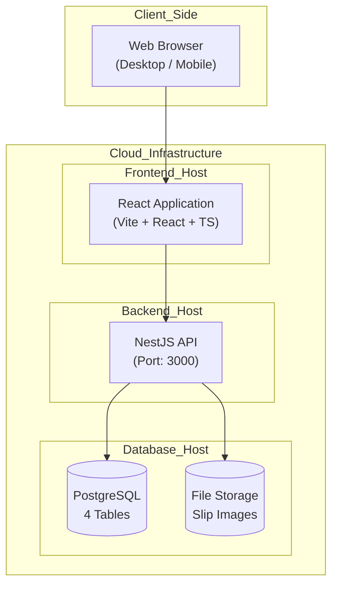
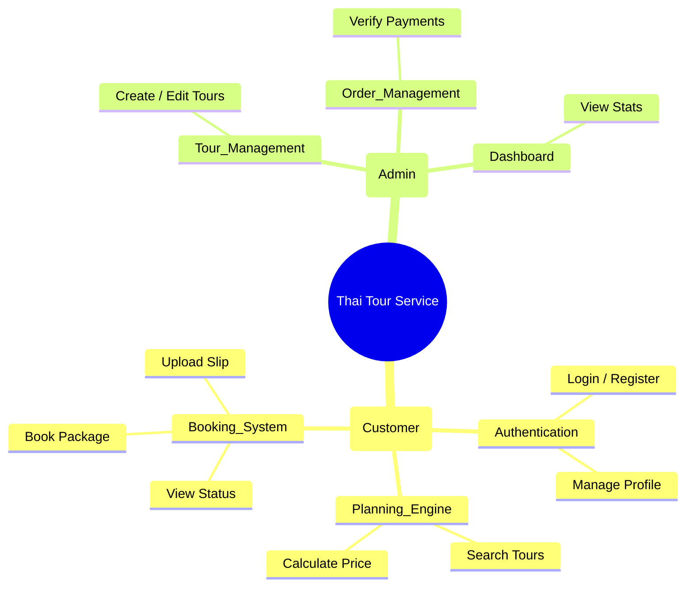
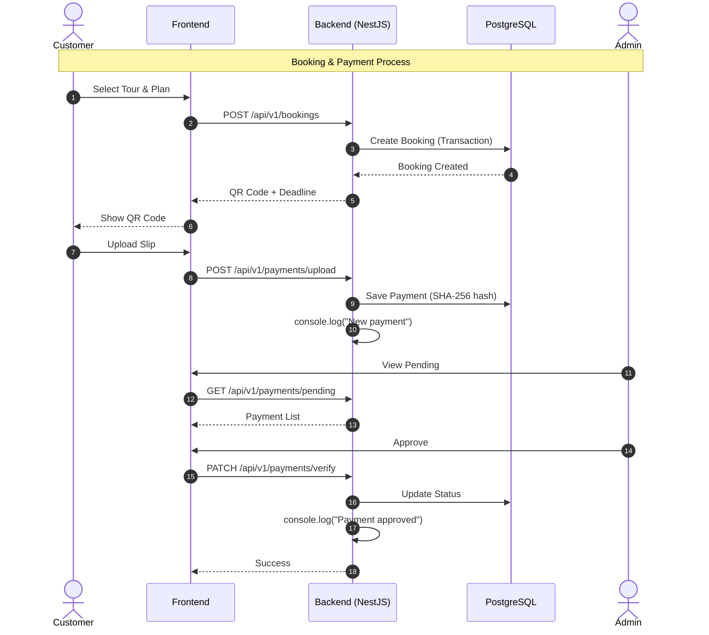

# System Overview - Simplified (Thai Tour Website)

> เอกสารนี้แสดงภาพรวมระบบแบบ **Simplified** ที่เหมาะสำหรับนักศึกษาปี 1

---

## 1. High-Level Architecture



---

## 2. Functional Overview



---

## 3. Core Process Flow (Booking & Payment)



---

## 4. Tech Stack (Simplified)

### Frontend
| Technology | Purpose |
|---|---|
| React + TypeScript | UI Framework |
| Vite | Build Tool |
| React Router | Routing |
| Axios | API Client |
| Tailwind CSS | Styling |
| date-fns | Date utilities |
| qrcode.react | QR Code |

### Backend
| Technology | Purpose |
|---|---|
| NestJS | Framework |
| TypeORM | ORM |
| PostgreSQL | Database |
| JWT | Authentication |
| bcrypt | Password hashing |
| class-validator | Validation |
| @nestjs/config | Config |
| @nestjs/schedule | Cron jobs |

### Infrastructure
| Service | Purpose |
|---|---|
| Vercel | Frontend Hosting |
| Render | Backend Hosting |
| Supabase | Database + Storage |

---

## 5. Data Flow Diagram

```mermaid
flowchart LR
    User[Customer] --> UI[React App]
    User --> AdminUI[Admin Dashboard]

    UI --> API[NestJS API]
    AdminUI --> API

    API --> DB[(PostgreSQL)]
    API --> Storage[(Supabase Storage)]

    API --> Console[console.log()<br>Email Simulation]

    subgraph Tables
        DB --> Users[users]
        DB --> Tours[tours]
        DB --> Bookings[bookings]
        DB --> Payments[payments]
    end
```

---

## 6. Summary of Simplifications

| Component | Original | Simplified |
|---|---|---|
| Database | 7 Tables | 4 Tables |
| Auth | Session + JWT | JWT only |
| Email | Queue System | console.log() |
| Logging | Winston | console.log() |
| Cache | Redis | None |
| Security | RLS + Complex | Guards + Basic |

---

**Last Updated:** 2026-02-10
**Status:** Simplified for Year 1 Students 🚀
