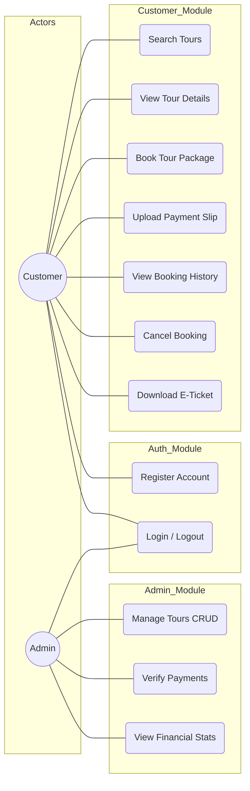
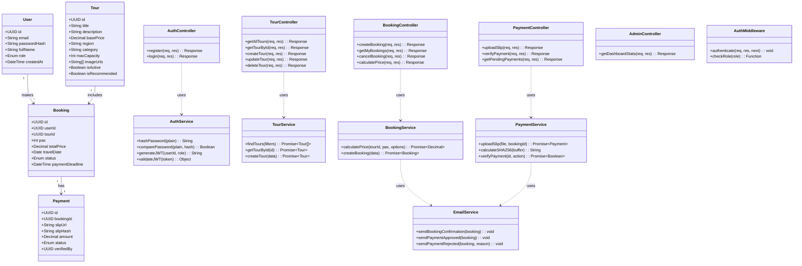
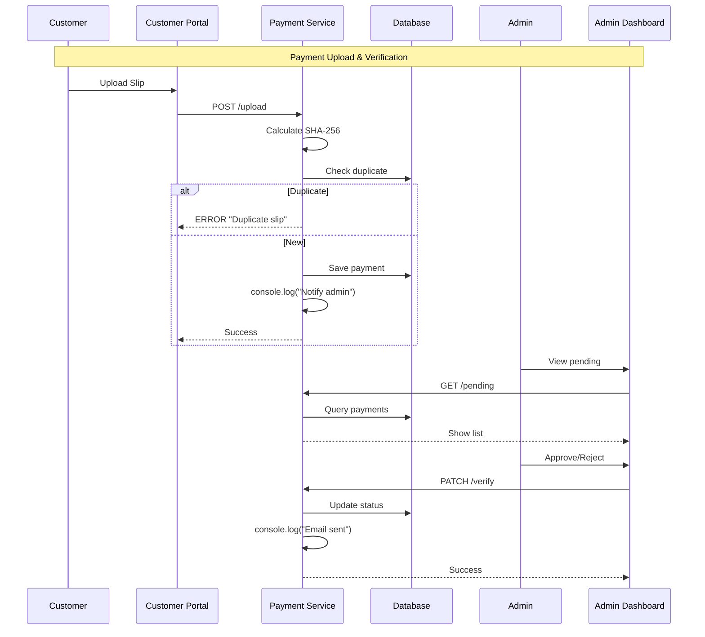

# System Component Design - Simplified (Thai Tour Website)

> เอกสารนี้แสดงการออกแบบส่วนประกอบระบบแบบ **Simplified** ที่เหมาะสำหรับนักศึกษาปี 1

---

## Overview

**Simplifications:**
- ❌ Session class → JWT only (stateless)
- ❌ AuditLog class → console.log()
- ❌ NotificationService with Queue → console.log()
- ❌ CacheService (Redis) → In-memory or none
- ❌ LoggerService (Winston) → console.log()
- ❌ RateLimitMiddleware → Simple or none

---

## 1. Use Case Diagram (Simplified)



---

## 2. Class Diagram (Simplified)



---

## 3. Payment Verification Flow (Simplified)



---

## 4. Email Service Implementation (Simple)

```typescript
@Injectable()
export class EmailService {
  sendBookingConfirmation(booking: any) {
    console.log('=================================');
    console.log('📧 BOOKING CONFIRMATION');
    console.log(`Booking ID: ${booking.id}`);
    console.log(`Total: ${booking.totalPrice}`);
    console.log('Please pay within 24 hours');
    console.log('=================================');
  }

  sendPaymentApproved(booking: any) {
    console.log('=================================');
    console.log('📧 PAYMENT APPROVED');
    console.log(`Booking ID: ${booking.id}`);
    console.log('E-Ticket ready');
    console.log('=================================');
  }

  sendPaymentRejected(booking: any, reason: string) {
    console.log('=================================');
    console.log('📧 PAYMENT REJECTED');
    console.log(`Booking ID: ${booking.id}`);
    console.log(`Reason: ${reason}`);
    console.log('=================================');
  }
}
```

---

## 5. Summary of Simplifications

| Original | Simplified |
|---|---|
| 7 Tables | 4 Tables |
| Session Class | JWT only |
| AuditLog Class | console.log() |
| NotificationService (Queue) | EmailService (console.log) |
| CacheService (Redis) | None |
| LoggerService (Winston) | console.log() |
| RateLimitMiddleware | None or @nestjs/throttler |
| Email Queue | console.log() |
| Password Reset | Admin reset |

---

**Last Updated:** 2026-02-10
**Status:** Simplified for Year 1 Students 🚀
