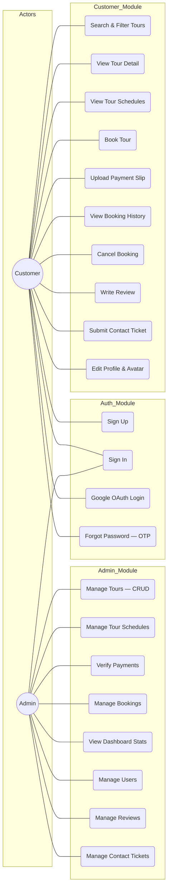
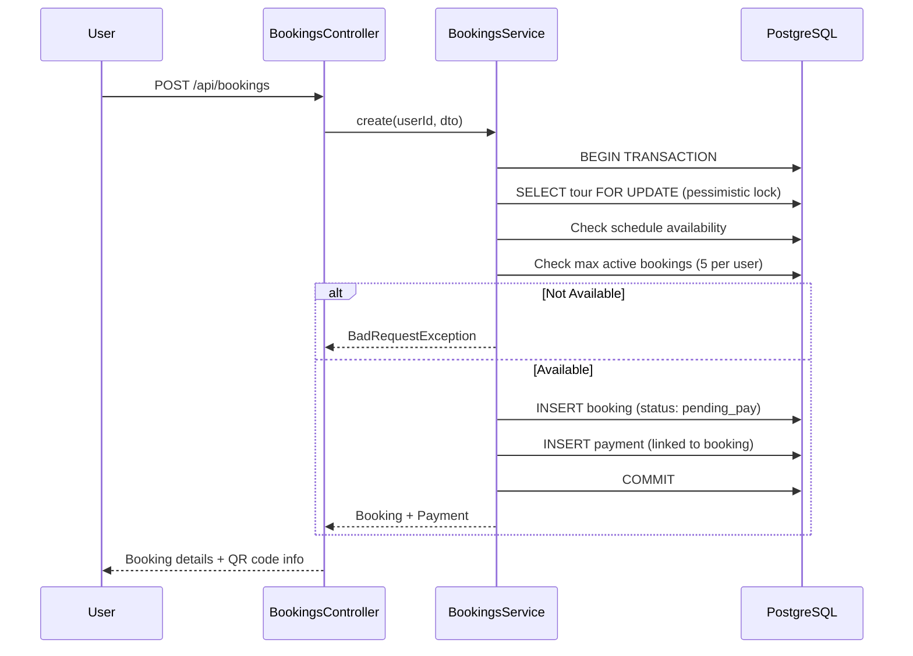
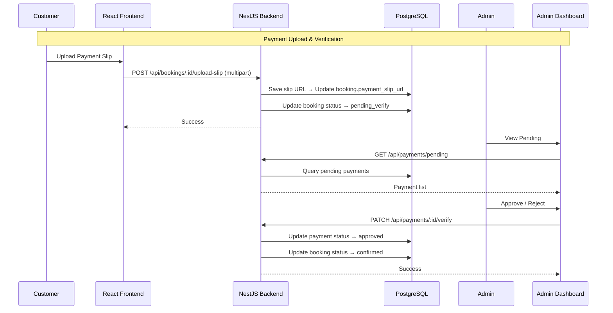

# System Component Design — Thai Tour Website

> เอกสารนี้แสดง Use Case Diagram, Class Diagram และ Flow ที่สอดคล้องกับโค้ดปัจจุบัน

---

## 1. Use Case Diagram

```mermaid
graph LR
    subgraph Actors
        Customer((Customer))
        Admin((Admin))
    end

    subgraph Auth_Module
        UC1(Sign Up)
        UC2(Sign In)
        UC3(Google OAuth Login)
        UC4(Forgot Password — OTP)
    end

    subgraph Customer_Module
        UC5(Search & Filter Tours)
        UC6(View Tour Detail)
        UC7(View Tour Schedules)
        UC8(Book Tour)
        UC9(Upload Payment Slip)
        UC10(View Booking History)
        UC11(Cancel Booking)
        UC12(Write Review)
        UC13(Submit Contact Ticket)
        UC14(Edit Profile & Avatar)
    end

    subgraph Admin_Module
        UC20(Manage Tours — CRUD)
        UC21(Manage Tour Schedules)
        UC22(Verify Payments)
        UC23(Manage Bookings)
        UC24(View Dashboard Stats)
        UC25(Manage Users)
        UC26(Manage Reviews)
        UC27(Manage Contact Tickets)
    end

    Customer --- UC1
    Customer --- UC2
    Customer --- UC3
    Customer --- UC4
    Customer --- UC5
    Customer --- UC6
    Customer --- UC7
    Customer --- UC8
    Customer --- UC9
    Customer --- UC10
    Customer --- UC11
    Customer --- UC12
    Customer --- UC13
    Customer --- UC14

    Admin --- UC2
    Admin --- UC20
    Admin --- UC21
    Admin --- UC22
    Admin --- UC23
    Admin --- UC24
    Admin --- UC25
    Admin --- UC26
    Admin --- UC27
```

---

## 2. Class Diagram

```mermaid
classDiagram
    %% ========== Models (Entities) ==========
    class User {
        +UUID id
        +String username
        +String password
        +String email
        +String firstName
        +String lastName
        +String fullName
        +String phone
        +String avatarUrl
        +Enum role — ADMIN/CUSTOMER/USER
        +Boolean isActive
        +String resetPasswordOtp
        +DateTime resetPasswordOtpExpires
        +String resetPasswordToken
        +DateTime createdAt
        +DateTime updatedAt
    }

    class Tour {
        +UUID id
        +String title
        +String description
        +Decimal price
        +Decimal childPrice
        +String province
        +Enum region — North/South/Central/East/West/Northeast
        +Enum duration — 1 day / 1 day 1 night / ...
        +Int maxGroupSize
        +Decimal rating
        +Int reviewCount
        +String imageCover
        +String[] images
        +String[] highlights
        +String[] preparation
        +String itinerary
        +JSONB itineraryData
        +String included
        +String excluded
        +String conditions
        +Enum category — Sea/Mountain/Cultural/Nature/City/Adventure
        +Boolean isActive
        +Boolean isRecommended
        +DateTime createdAt
        +DateTime updatedAt
    }

    class TourSchedule {
        +UUID id
        +UUID tourId
        +Date availableDate
        +Int maxCapacityOverride
        +Boolean isAvailable
        +DateTime createdAt
    }

    class Booking {
        +UUID id
        +String bookingReference
        +UUID tourId
        +UUID userId
        +UUID tourScheduleId
        +Date travelDate
        +Date startDate
        +Date endDate
        +Int pax
        +Decimal basePrice
        +Decimal discount
        +Decimal totalPrice
        +Enum status — PENDING_PAY/PENDING_VERIFY/CONFIRMED/CANCELLED/EXPIRED
        +String paymentSlipUrl
        +DateTime paymentDeadline
        +JSONB selectedOptions
        +JSONB contactInfo
        +String specialRequests
        +String cancellationReason
        +Decimal refundAmount
        +DateTime createdAt
        +DateTime updatedAt
    }

    class Payment {
        +UUID id
        +Decimal amount
        +String slipUrl
        +String status — pending_verify/approved/rejected
        +DateTime verifiedAt
        +DateTime uploadedAt
    }

    class Review {
        +UUID id
        +UUID userId
        +UUID tourId
        +UUID bookingId
        +Int rating — 1-5
        +String comment
        +Boolean isRecommended
        +DateTime createdAt
        +DateTime updatedAt
    }

    class Ticket {
        +UUID id
        +String firstName
        +String lastName
        +String email
        +String phone
        +String message
        +String status — pending/resolved/cancelled
        +DateTime createdAt
    }

    %% ========== Controllers ==========
    class AuthController {
        +signUp(dto): Response
        +signIn(dto): Response
        +googleAuth(): Redirect
        +googleCallback(): Redirect
        +getProfile(req): Response
        +forgotPassword(dto): Response
        +verifyOtp(dto): Response
        +resetPassword(dto): Response
    }

    class UsersController {
        +getMe(req): Response
        +updateMe(req, dto): Response
        +uploadAvatar(req, file): Response
        +findAll(): Response
        +create(dto): Response
        +findOne(id): Response
        +update(id, dto): Response
        +remove(id): Response
    }

    class ToursController {
        +getTours(filters): Response
        +getRecommended(): Response
        +getTourById(id): Response
        +create(dto, files): Response
        +update(id, dto, files): Response
        +remove(id): Response
    }

    class BookingsController {
        +calculatePrice(dto): Response
        +create(req, dto): Response
        +getMyBookings(req): Response
        +findOne(id): Response
        +cancel(id, req): Response
        +uploadSlip(id, file): Response
    }

    class PaymentsController {
        +generateQr(id): Response
        +getPending(): Response
        +verify(id, dto): Response
        +webhook(body): Response
        +checkStatus(id): Response
    }

    class ReviewsController {
        +create(req, dto): Response
        +getRecommended(limit): Response
        +getByTour(tourId, page): Response
        +getForAdmin(filters): Response
        +updateByAdmin(id, dto): Response
    }

    class TicketsController {
        +create(dto): Response
        +findAll(): Response
        +updateStatus(id, dto): Response
    }

    class AdminController {
        +getStats(): Response
        +getBookings(): Response
        +deleteBooking(id): Response
        +updateBookingStatus(id, dto): Response
    }

    %% ========== Services ==========
    class AuthService {
        +signUp(dto): Promise~User~
        +signIn(dto): Promise~Token~
        +googleLogin(profile): Promise~Token~
        +forgotPassword(email): Promise~void~
        +verifyOtp(email, otp): Promise~Token~
        +resetPasswordWithToken(token, password): Promise~void~
    }

    class ToursService {
        +getTours(filters): Promise~Tour[]~
        +getRecommendedTours(): Promise~Tour[]~
        +getTourById(id): Promise~Tour~
        +create(data, images): Promise~Tour~
        +update(id, data): Promise~Tour~
        +remove(id): Promise~void~
    }

    class BookingsService {
        +calculatePrice(dto): Promise~PriceResult~
        +create(userId, dto): Promise~Booking~
        +findAllByUser(userId): Promise~Booking[]~
        +cancelBooking(id, userId): Promise~Booking~
        +uploadPaymentSlip(id, file): Promise~Booking~
        +expirePayments(): void — Cron
    }

    class PaymentsService {
        +generateQrCode(bookingId): Promise~QR~
        +findPending(): Promise~Payment[]~
        +verifyPayment(id, status): Promise~Payment~
        +checkStatus(id): Promise~Payment~
    }

    class ReviewsService {
        +create(userId, dto): Promise~Review~
        +findByTour(tourId): Promise~Review[]~
        +findRecommended(): Promise~Review[]~
        +refreshTourRating(tourId): Promise~void~
    }

    %% ========== Middleware ==========
    class AuthGuard_JWT {
        +canActivate(context): Boolean
    }

    class RolesGuard {
        +canActivate(context): Boolean
    }

    %% ========== Relationships ==========
    User "1" --> "*" Booking : makes
    User "1" --> "*" Review : writes
    Tour "1" --> "*" Booking : has
    Tour "1" --> "*" TourSchedule : has schedules
    Tour "1" --> "*" Review : receives
    Booking "1" --> "1" Payment : has
    Booking "1" --> "0..1" Review : has

    AuthController ..> AuthService : uses
    UsersController ..> UsersService : uses
    ToursController ..> ToursService : uses
    BookingsController ..> BookingsService : uses
    PaymentsController ..> PaymentsService : uses
    ReviewsController ..> ReviewsService : uses
    TicketsController ..> TicketsService : uses
    AdminController ..> AdminService : uses
```

---

## 3. Booking Creation Flow (Transaction)

```mermaid
sequenceDiagram
    participant User
    participant Controller as BookingsController
    participant Service as BookingsService
    participant DB as PostgreSQL

    User->>Controller: POST /api/bookings
    Controller->>Service: create(userId, dto)

    Service->>DB: BEGIN TRANSACTION
    Service->>DB: SELECT tour FOR UPDATE (pessimistic lock)
    Service->>DB: Check schedule availability
    Service->>DB: Check max active bookings (5 per user)

    alt Not Available
        Service-->>Controller: BadRequestException
    else Available
        Service->>DB: INSERT booking (status: pending_pay)
        Service->>DB: INSERT payment (linked to booking)
        Service->>DB: COMMIT
        Service-->>Controller: Booking + Payment
    end

    Controller-->>User: Booking details + QR code info
```

---

## 4. Payment Verification Flow

```mermaid
sequenceDiagram
    participant Customer
    participant UI as React Frontend
    participant API as NestJS Backend
    participant DB as PostgreSQL
    participant Admin
    participant Dashboard as Admin Dashboard

    Note over Customer, Dashboard: Payment Upload & Verification

    Customer->>UI: Upload Payment Slip
    UI->>API: POST /api/bookings/:id/upload-slip (multipart)

    API->>DB: Save slip URL → Update booking.payment_slip_url
    API->>DB: Update booking status → pending_verify
    API-->>UI: Success

    Admin->>Dashboard: View Pending
    Dashboard->>API: GET /api/payments/pending
    API->>DB: Query pending payments
    API-->>Dashboard: Payment list

    Admin->>Dashboard: Approve / Reject
    Dashboard->>API: PATCH /api/payments/:id/verify

    API->>DB: Update payment status → approved
    API->>DB: Update booking status → confirmed
    API-->>Dashboard: Success
```

---

## 5. Summary

| Aspect | สถานะปัจจุบัน |
|---|---|
| Tables | 7 ตาราง (users, tours, tour_schedules, bookings, payments, reviews, tickets) |
| Backend Modules | 9 modules (auth, users, tours, schedules, bookings, payments, reviews, tickets, admin) |
| Auth | JWT + Google OAuth + OTP password reset |
| Email | Nodemailer (OTP only), console.log สำหรับอื่น |
| Cache | ไม่ใช้ |
| Payment | PromptPay QR + Admin manual verify |
| Scheduling | @Cron — expire pending bookings |

---

**Last Updated:** 2026-03-06
**Status:** สอดคล้องกับโค้ดปัจจุบัน
