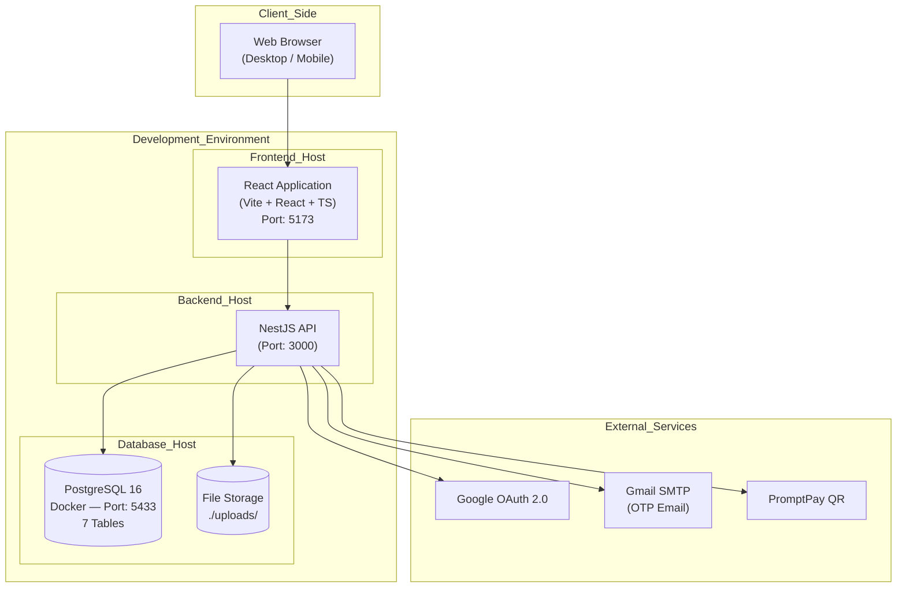
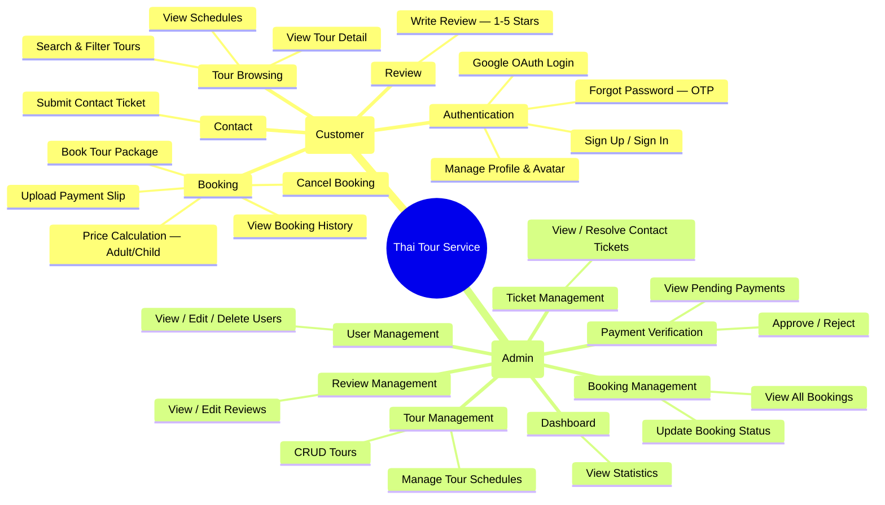
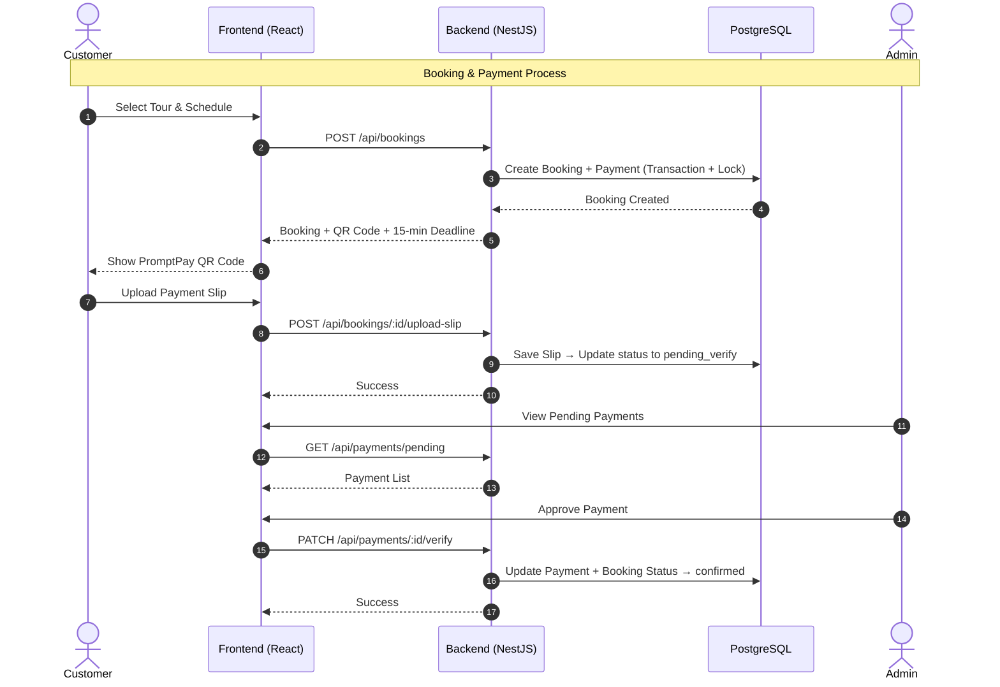
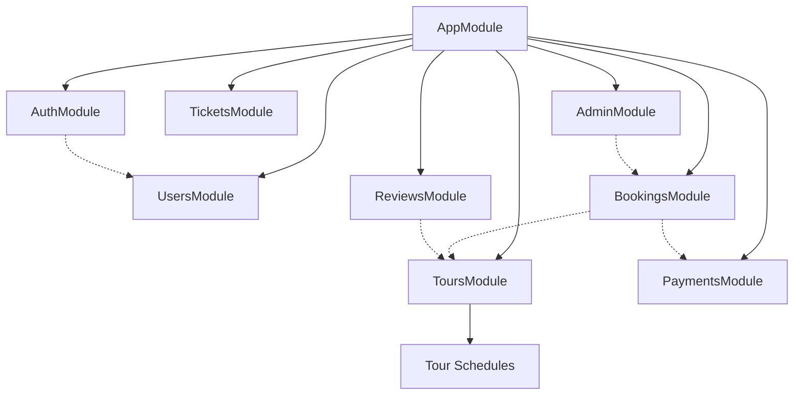

# System Overview - Thai Tour Website

> เอกสารนี้แสดงภาพรวมระบบ Thai Tour Booking Website ตามสถานะโปรเจกปัจจุบัน

---

## 1. High-Level Architecture



---

## 2. Functional Overview



---

## 3. Core Process Flow (Booking & Payment)



---

## 4. Tech Stack

### Frontend
| Technology | Purpose |
|---|---|
| React 18 + TypeScript | UI Framework |
| Vite | Build Tool & Dev Server |
| React Router v7 | Client-side Routing |
| Axios + Fetch | API Client |
| Tailwind CSS v4 | Styling (warm palette: #FF8400, #4F200D, #F6F1E9) |
| shadcn/ui | UI Component Library (Badge, Button, Card, Input) |
| date-fns | Date utilities |

### Backend
| Technology | Purpose |
|---|---|
| NestJS | Framework |
| TypeORM | ORM (synchronize: true ใน dev) |
| PostgreSQL 16 | Database (Docker, port 5433) |
| JWT (@nestjs/jwt) | Authentication |
| Passport (@nestjs/passport) | Auth strategies (JWT + Google OAuth) |
| bcrypt | Password hashing |
| class-validator | DTO Validation |
| class-transformer | Data transformation |
| @nestjs/config | Environment config |
| @nestjs/schedule | Cron jobs (expire bookings) |
| Nodemailer | Send OTP Email (Gmail SMTP) |
| Multer | File upload (slips, avatars, tour images) |
| promptpay-qr | PromptPay QR code generation |

### Infrastructure (Development)
| Service | Purpose |
|---|---|
| Docker Compose | PostgreSQL container (port 5433) |
| Vite Dev Server | Frontend on localhost:5173 |
| NestJS Dev Server | Backend on localhost:3000 |
| Local Disk (./uploads/) | File storage (slips, avatars) |

---

## 5. Data Flow Diagram

```mermaid
flowchart LR
    User[Customer] --> UI[React App<br>:5173]
    User --> AdminUI[Admin Dashboard]

    UI --> API[NestJS API<br>:3000]
    AdminUI --> API

    API --> DB[(PostgreSQL<br>:5433)]
    API --> Storage[(./uploads/<br>slips, avatars)]
    API --> Gmail[Gmail SMTP<br>OTP Email]
    API --> Google[Google OAuth]

    subgraph Tables — 7 ตาราง
        DB --> Users[users]
        DB --> Tours[tours]
        DB --> TourSchedules[tour_schedules]
        DB --> Bookings[bookings]
        DB --> Payments[payments]
        DB --> Reviews[reviews]
        DB --> Tickets[tickets]
    end
```

---

## 6. Backend Module Overview



| Module | Controller Prefix | Primary Purpose |
|---|---|---|
| Auth | `api/auth` | Sign up, Sign in, Google OAuth, OTP Password Reset |
| Users | `api/users` | Profile, Avatar, Admin user management |
| Tours | `api/tours` | Tour CRUD, Filters, Schedules |
| Bookings | `api/bookings` | Create booking, Cancel, Upload slip |
| Payments | `api/payments` | QR code, Pending list, Verify/Reject |
| Reviews | `api/reviews` | Create review, Recommended, Admin management |
| Tickets | `api/tickets` | Contact form submissions |
| Admin | `api/admin` | Dashboard stats, Booking management |

---

## 7. Summary — Design Decisions

| Aspect | ที่ใช้ในโปรเจก | หมายเหตุ |
|---|---|---|
| Database | 7 Tables (PostgreSQL + TypeORM) | synchronize: true (dev) |
| Auth | JWT + Google OAuth + OTP | Stateless JWT, token ใน localStorage |
| Email | Nodemailer (OTP only) + console.log | ส่งจริงเฉพาะ OTP reset password |
| Logging | console.log() | ไม่ใช้ Winston |
| Cache | ไม่ใช้ | Query DB ตรง |
| Security | AuthGuard + RolesGuard | ไม่ใช้ RLS |
| File Upload | Multer + Local Disk | Slips 5MB, Avatars 2MB |
| Payment | PromptPay QR + Manual verify | Deadline 15 นาที |
| Scheduling | @nestjs/schedule + @Cron | Expire pending bookings |

---

**Last Updated:** 2026-03-06
**Status:** สอดคล้องกับโค้ดปัจจุบัน
