# User Flow - Simplified (Thai Tour Website)

> เอกสารนี้อธิบายขั้นตอนการใช้งานระบบแบบ **Simplified** ที่เหมาะสำหรับนักศึกษาปี 1

---

## Overview

**Simplifications:**
- ❌ Email verification → Skip in v1.0
- ❌ Password reset → Admin reset instead
- ❌ Email Queue → console.log()
- ❌ Audit Logs → console.log()

---

## 1. Customer User Flows

### 1.1 Registration & Login

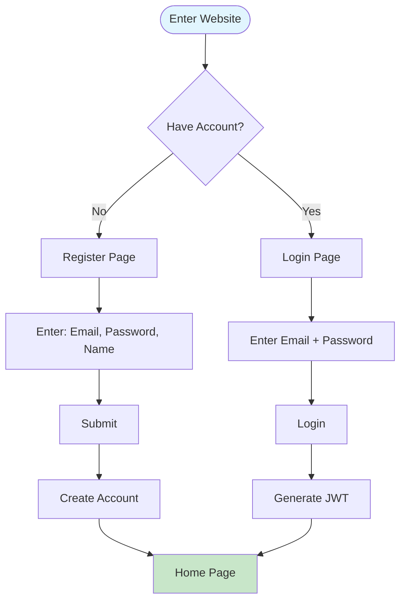

---

### 1.2 Search & Browse Tours

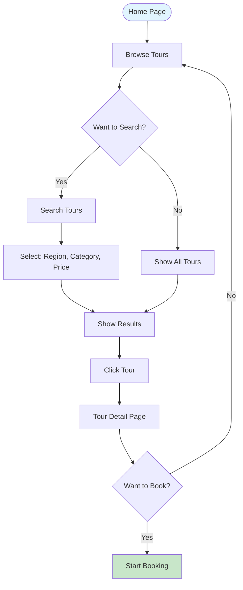

---

### 1.3 Booking Flow

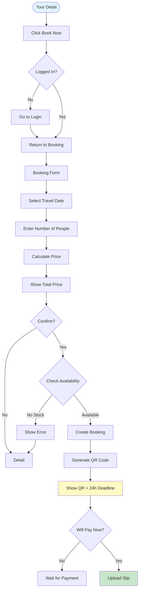

---

### 1.4 Payment Flow

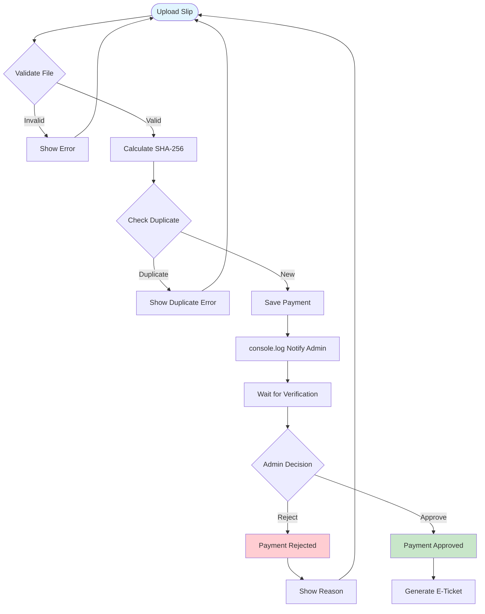

---

### 1.5 My Bookings

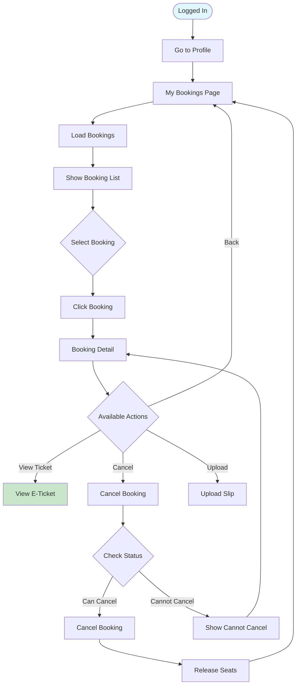

---

## 2. Admin User Flows

### 2.1 Admin Login

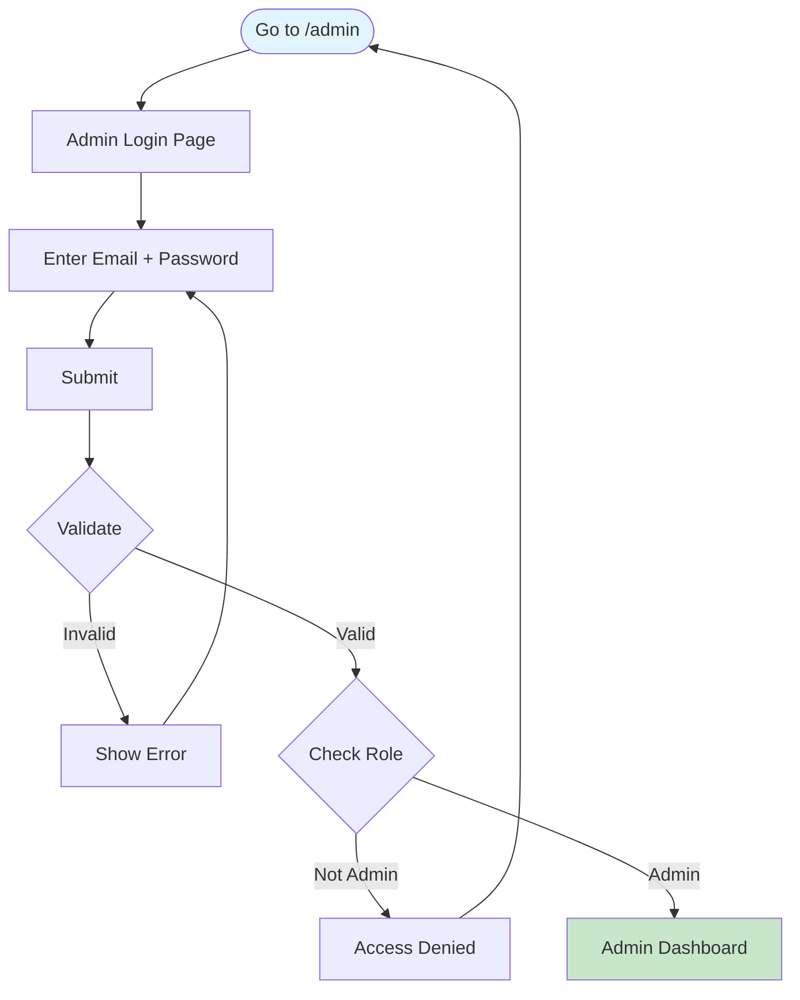

---

### 2.2 Manage Tours

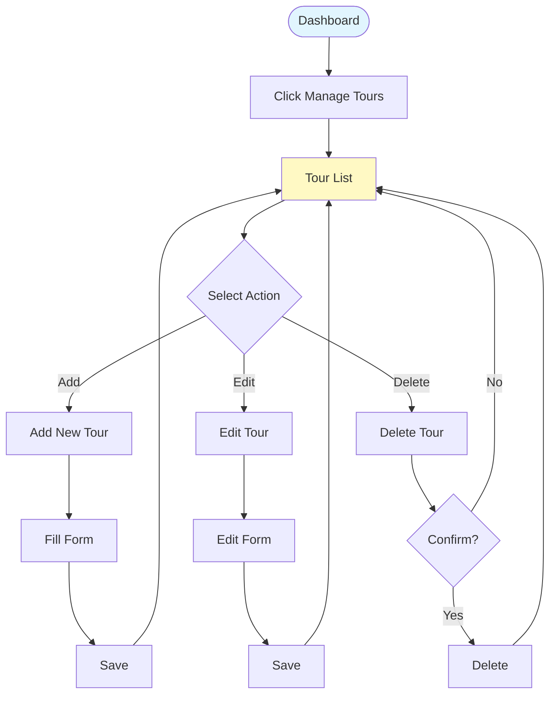

---

### 2.3 Verify Payments

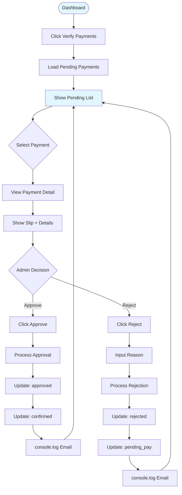

---

### 2.4 Dashboard Stats

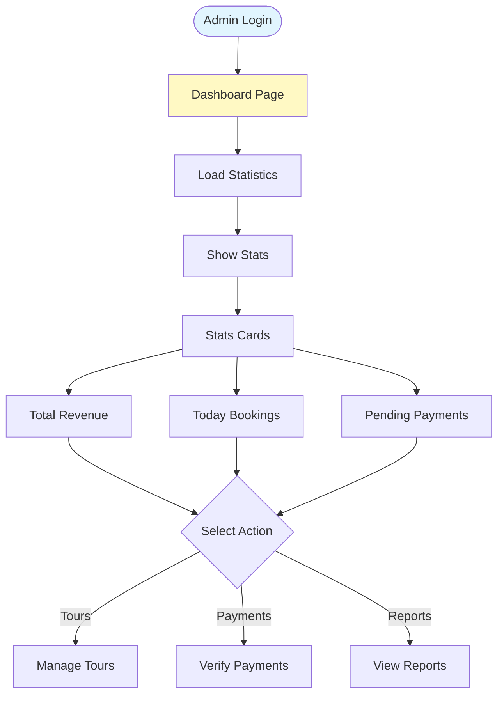

---

## 3. Error Handling Flows

### 3.1 Common Errors

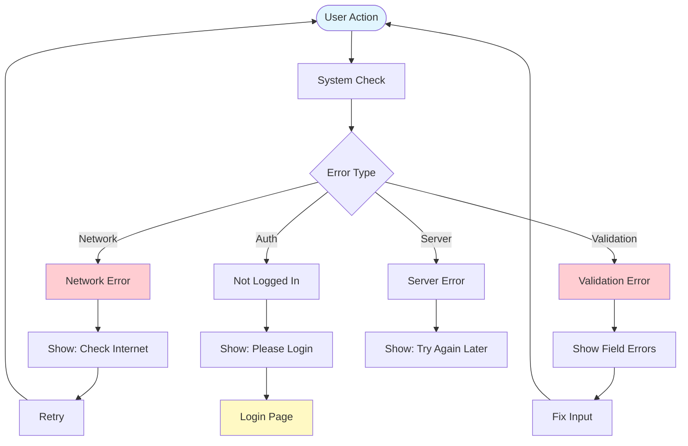

---

## 4. Booking Status Flow

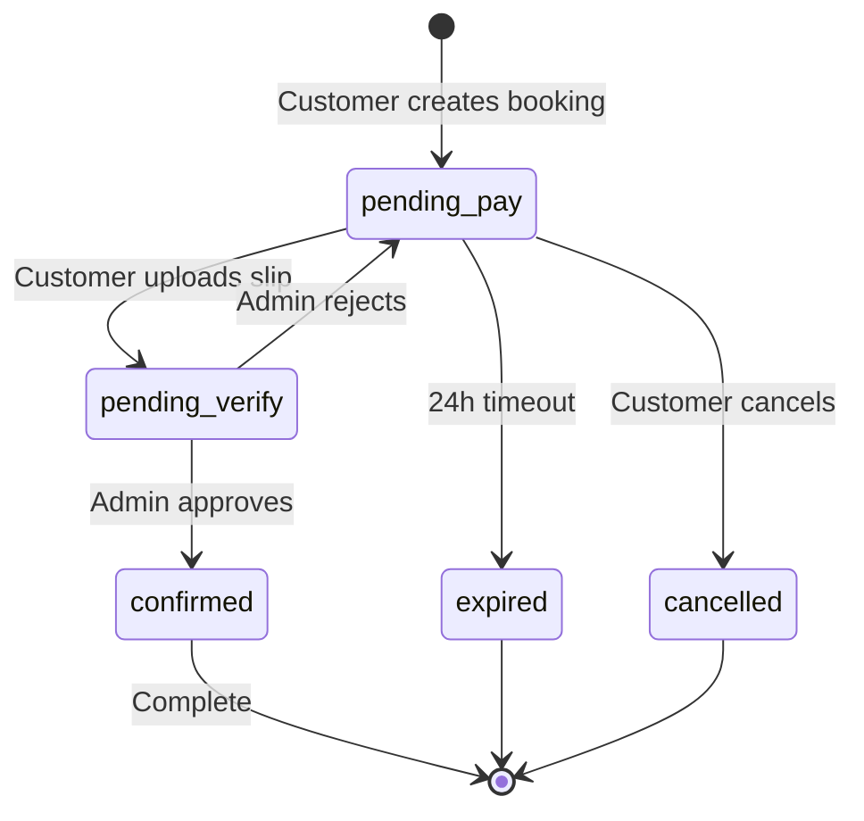

---

## 5. Summary of Simplifications

| Flow | Original | Simplified |
|---|---|---|
| Email Verification | Required | Skip in v1.0 |
| Password Reset | Self-service | Admin reset |
| Email Queue | Queue system | console.log() |
| Audit Logs | Database table | console.log() |
| Session Management | Session table | JWT only |

---

## 6. Estimated Time

| Process | Time |
|---|---|
| Register | 1-2 min |
| Login | 30 sec |
| Search Tours | 3-5 min |
| Book Tour | 2-3 min |
| Upload Slip | 1-2 min |
| Verify Payment | ~12 hours (SLA) |

---

**Last Updated:** 2026-02-10
**Status:** Simplified for Year 1 Students 🚀
