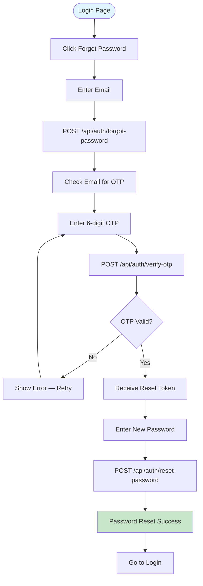
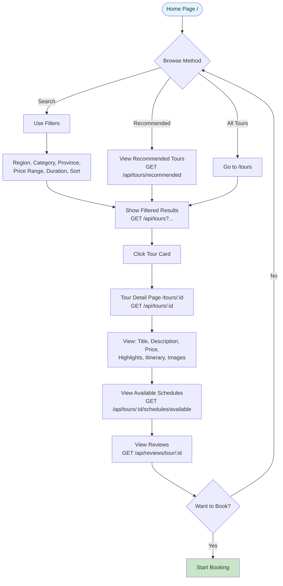
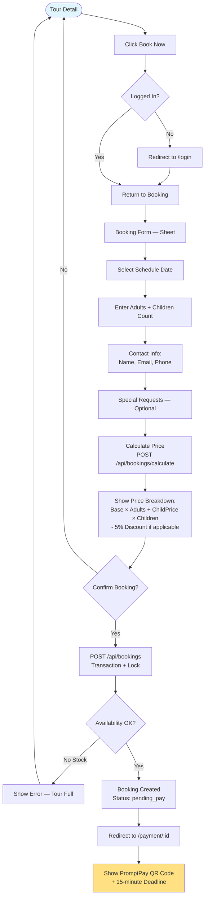
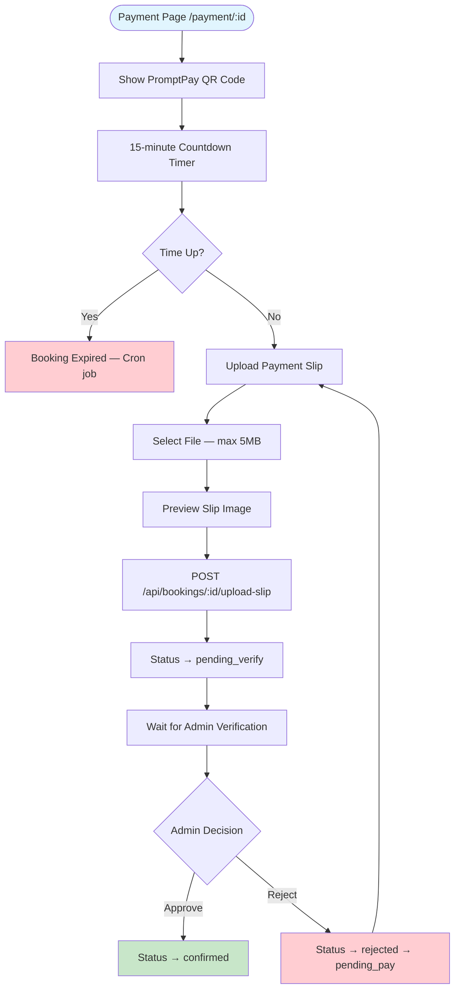
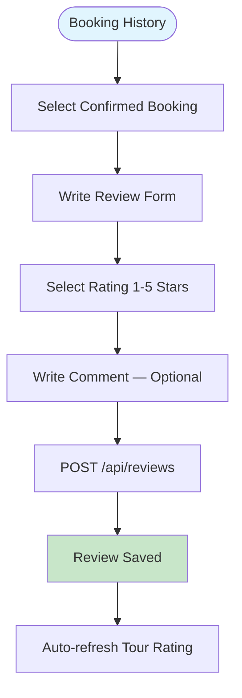
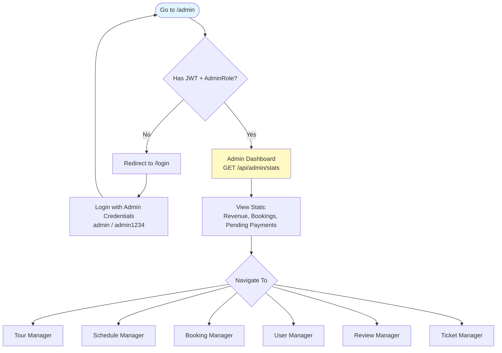
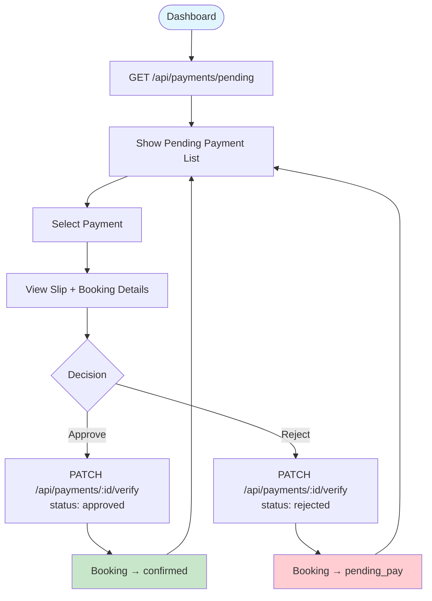
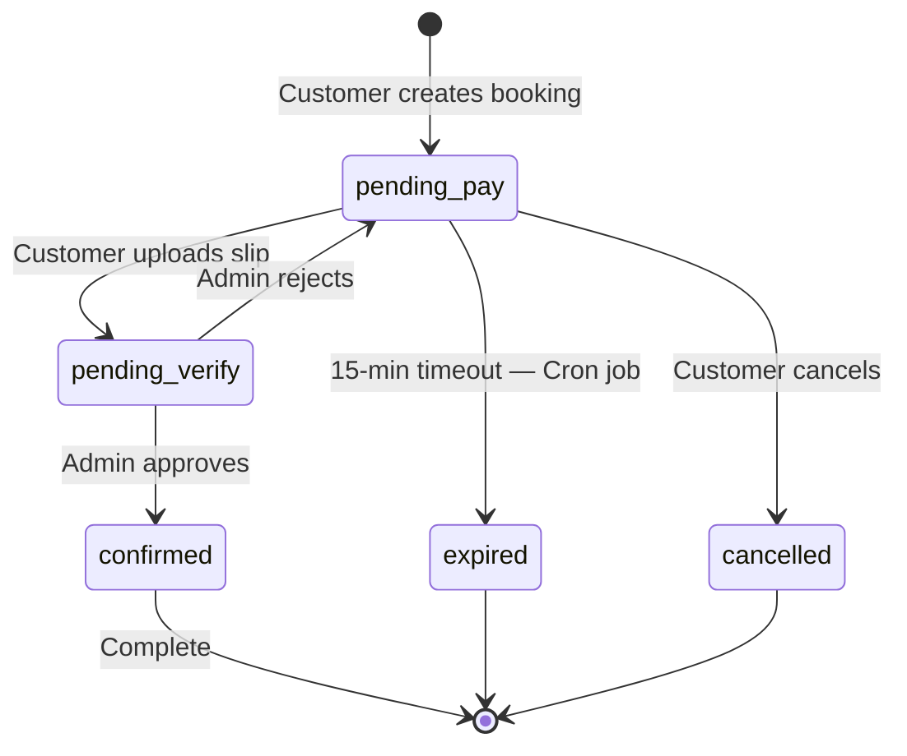

# User Flow — Thai Tour Website

> เอกสารนี้อธิบายขั้นตอนการใช้งานระบบตามฟีเจอร์ที่มีอยู่จริงในโค้ดปัจจุบัน

---

## 1. Customer User Flows

### 1.1 Registration & Login

```mermaid
flowchart TD
    Start([Enter Website]) --> Choice{Have Account?}

    Choice -- No --> Register[Register Page /register]
    Register --> InputReg[Enter: Username, Password]
    InputReg --> OptProfile[Optional: Email, Name, Phone]
    OptProfile --> SubmitReg[Submit → POST /api/auth/signup]
    SubmitReg --> CreateAcc[Create Account]
    CreateAcc --> LoginPage[Go to Login]

    Choice -- Yes --> Login[Login Page /login]
    Login --> Method{Login Method?}

    Method -- Username/Password --> InputLog[Enter Username + Password]
    InputLog --> SubmitLog[Submit → POST /api/auth/signin]
    SubmitLog --> GenToken[Receive JWT Token]
    GenToken --> SaveToken[Store in localStorage]
    SaveToken --> Home[Home Page /]

    Method -- Google --> GoogleBtn[Click Google Login]
    GoogleBtn --> GoogleOAuth[GET /api/auth/google]
    GoogleOAuth --> GoogleConsent[Google Consent Screen]
    GoogleConsent --> Callback[/api/auth/google/callback]
    Callback --> Redirect[Redirect to /login/success?token=...]
    Redirect --> SaveToken

    style Start fill:#E1F5FE
    style Home fill:#C8E6C9
```

---

### 1.2 Forgot Password (OTP Flow)

```mermaid
flowchart TD
    Login([Login Page]) --> Forgot[Click Forgot Password]
    Forgot --> InputEmail[Enter Email]
    InputEmail --> SendOTP[POST /api/auth/forgot-password]
    SendOTP --> CheckEmail[Check Email for OTP]
    CheckEmail --> InputOTP[Enter 6-digit OTP]
    InputOTP --> VerifyOTP[POST /api/auth/verify-otp]

    VerifyOTP --> Valid{OTP Valid?}
    Valid -- No --> Error[Show Error — Retry]
    Error --> InputOTP

    Valid -- Yes --> GetToken[Receive Reset Token]
    GetToken --> NewPassword[Enter New Password]
    NewPassword --> ResetPW[POST /api/auth/reset-password]
    ResetPW --> Success[Password Reset Success]
    Success --> Login2[Go to Login]

    style Login fill:#E1F5FE
    style Success fill:#C8E6C9
```

---

### 1.3 Search & Browse Tours

```mermaid
flowchart TD
    Home([Home Page /]) --> Browse{Browse Method}

    Browse -- Recommended --> Recommended[View Recommended Tours<br>GET /api/tours/recommended]
    Browse -- Search --> Search[Use Filters]
    Browse -- All Tours --> AllTours[Go to /tours]

    Search --> Filters[Region, Category, Province,<br>Price Range, Duration, Sort]
    Filters --> Results[Show Filtered Results<br>GET /api/tours?...]

    Recommended --> Results
    AllTours --> Results

    Results --> Select[Click Tour Card]
    Select --> Detail[Tour Detail Page /tours/:id<br>GET /api/tours/:id]

    Detail --> ViewInfo[View: Title, Description, Price,<br>Highlights, Itinerary, Images]
    ViewInfo --> ViewSchedules[View Available Schedules<br>GET /api/tours/:id/schedules/available]
    ViewSchedules --> ViewReviews[View Reviews<br>GET /api/reviews/tour/:id]

    ViewReviews --> Decide{Want to Book?}

    Decide -- No --> Browse
    Decide -- Yes --> BookFlow[Start Booking]

    style Home fill:#E1F5FE
    style BookFlow fill:#C8E6C9
```

---

### 1.4 Booking Flow

```mermaid
flowchart TD
    Start([Tour Detail]) --> ClickBook[Click Book Now]

    ClickBook --> CheckLogin{Logged In?}
    CheckLogin -- No --> Login[Redirect to /login]
    Login --> Back[Return to Booking]
    CheckLogin -- Yes --> Back

    Back --> BookForm[Booking Form — Sheet]
    BookForm --> SelectDate[Select Schedule Date]
    SelectDate --> InputPax[Enter Adults + Children Count]
    InputPax --> InputContact[Contact Info:<br>Name, Email, Phone]
    InputContact --> SpecialReq[Special Requests — Optional]
    SpecialReq --> CalcPrice[Calculate Price<br>POST /api/bookings/calculate]

    CalcPrice --> ShowPrice[Show Price Breakdown:<br>Base × Adults + ChildPrice × Children<br>- 5% Discount if applicable]

    ShowPrice --> Confirm{Confirm Booking?}
    Confirm -- No --> Start

    Confirm -- Yes --> CreateBooking[POST /api/bookings<br>Transaction + Lock]
    CreateBooking --> CheckAvail{Availability OK?}

    CheckAvail -- No Stock --> Error[Show Error — Tour Full]
    Error --> Start

    CheckAvail -- Yes --> Created[Booking Created<br>Status: pending_pay]
    Created --> Redirect[Redirect to /payment/:id]
    Redirect --> ShowQR[Show PromptPay QR Code<br>+ 15-minute Deadline]

    style Start fill:#E1F5FE
    style ShowQR fill:#FFE082
```

---

### 1.5 Payment Flow

```mermaid
flowchart TD
    PayPage([Payment Page /payment/:id]) --> ShowQR[Show PromptPay QR Code]
    ShowQR --> Countdown[15-minute Countdown Timer]

    Countdown --> TimeUp{Time Up?}
    TimeUp -- Yes --> Expired[Booking Expired — Cron job]
    TimeUp -- No --> Upload[Upload Payment Slip]

    Upload --> SelectFile[Select File — max 5MB]
    SelectFile --> Preview[Preview Slip Image]
    Preview --> Submit[POST /api/bookings/:id/upload-slip]

    Submit --> Saved[Status → pending_verify]
    Saved --> WaitVerify[Wait for Admin Verification]

    WaitVerify --> Admin{Admin Decision}

    Admin -- Approve --> Confirmed[Status → confirmed]
    Admin -- Reject --> Rejected[Status → rejected → pending_pay]
    Rejected --> Upload

    style PayPage fill:#E1F5FE
    style Confirmed fill:#C8E6C9
    style Expired fill:#FFCDD2
    style Rejected fill:#FFCDD2
```

---

### 1.6 Booking History & Cancel

```mermaid
flowchart TD
    LoggedIn([Logged In]) --> MyBookings[/booking-history<br>GET /api/bookings/my-bookings]

    MyBookings --> List[Show Booking List<br>with Status Badges]
    List --> Select[Select Booking]
    Select --> Detail[Booking Detail]

    Detail --> Actions{Available Actions}

    Actions -- pending_pay --> CanPay[Go to Payment Page]
    Actions -- pending_pay --> CanCancel[Cancel Booking<br>PATCH /api/bookings/:id/cancel]
    Actions -- confirmed --> ViewOnly[View Details Only]

    CanCancel --> Released[Seats Released — Status → cancelled]

    style LoggedIn fill:#E1F5FE
    style Released fill:#FFCDD2
```

---

### 1.7 Write Review

```mermaid
flowchart TD
    BookingHistory([Booking History]) --> SelectConfirmed[Select Confirmed Booking]
    SelectConfirmed --> WriteReview[Write Review Form]
    WriteReview --> InputRating[Select Rating 1-5 Stars]
    InputRating --> InputComment[Write Comment — Optional]
    InputComment --> Submit[POST /api/reviews]
    Submit --> Success[Review Saved]
    Success --> UpdateRating[Auto-refresh Tour Rating]

    style BookingHistory fill:#E1F5FE
    style Success fill:#C8E6C9
```

---

### 1.8 Profile Management

```mermaid
flowchart TD
    LoggedIn([Logged In]) --> Profile[/profile<br>GET /api/users/me]
    Profile --> View[View Profile Info]
    View --> Actions{Action}

    Actions -- Edit --> EditForm[Edit Name, Email, Phone]
    EditForm --> Save[PATCH /api/users/me]
    Save --> View

    Actions -- Avatar --> UploadAvatar[Upload Avatar — 2MB, PNG/JPG]
    UploadAvatar --> SaveAvatar[POST /api/users/me/avatar]
    SaveAvatar --> View

    style LoggedIn fill:#E1F5FE
    style View fill:#C8E6C9
```

---

### 1.9 Contact / Ticket

```mermaid
flowchart TD
    AnyPage([Any Page]) --> Contact[/contact]
    Contact --> Form[Fill Form:<br>Name, Email, Phone, Message]
    Form --> Submit[POST /api/tickets]
    Submit --> Success[Ticket Created — pending]

    style AnyPage fill:#E1F5FE
    style Success fill:#C8E6C9
```

---

## 2. Admin User Flows

### 2.1 Admin Login & Dashboard

```mermaid
flowchart TD
    Start([Go to /admin]) --> CheckAuth{Has JWT + AdminRole?}

    CheckAuth -- No --> Redirect[Redirect to /login]
    Redirect --> Login[Login with Admin Credentials<br>admin / admin1234]
    Login --> Start

    CheckAuth -- Yes --> Dashboard[Admin Dashboard<br>GET /api/admin/stats]

    Dashboard --> Stats[View Stats:<br>Revenue, Bookings, Pending Payments]

    Stats --> Navigate{Navigate To}
    Navigate --> Tours[Tour Manager]
    Navigate --> Schedules[Schedule Manager]
    Navigate --> Bookings[Booking Manager]
    Navigate --> Users[User Manager]
    Navigate --> Reviews[Review Manager]
    Navigate --> Tickets[Ticket Manager]

    style Start fill:#E1F5FE
    style Dashboard fill:#FFF9C4
```

---

### 2.2 Manage Tours

```mermaid
flowchart TD
    Dashboard([Dashboard]) --> Menu[/admin/tours]
    Menu --> List[Tour List — GET /api/tours]

    List --> Action{Action}

    Action -- Add --> Add[Create Tour Form]
    Add --> AddForm[Fill: Title, Description, Price,<br>ChildPrice, Province, Region,<br>Category, Duration, Images]
    AddForm --> SaveAdd[POST /api/tours — multipart]
    SaveAdd --> List

    Action -- Edit --> Edit[Edit Tour]
    Edit --> EditForm[Edit Form]
    EditForm --> SaveEdit[PATCH /api/tours/:id]
    SaveEdit --> List

    Action -- Delete --> Delete[DELETE /api/tours/:id]
    Delete --> List

    style Dashboard fill:#E1F5FE
    style List fill:#FFF9C4
```

---

### 2.3 Manage Tour Schedules

```mermaid
flowchart TD
    Dashboard([Dashboard]) --> SchedulePage[/admin/schedules]
    SchedulePage --> SelectTour[Select Tour]
    SelectTour --> ViewSchedules[GET /api/tours/:id/schedules]

    ViewSchedules --> Action{Action}

    Action -- Add Date --> AddDate[Select Available Date]
    AddDate --> SaveDate[POST /api/tours/:id/schedules]
    SaveDate --> ViewSchedules

    Action -- Toggle --> Toggle[Enable/Disable Date]
    Toggle --> Update[PATCH /api/tours/:id/schedules/:schedId]
    Update --> ViewSchedules

    Action -- Delete --> Delete[DELETE /api/tours/:id/schedules/:schedId]
    Delete --> ViewSchedules

    style Dashboard fill:#E1F5FE
```

---

### 2.4 Verify Payments

```mermaid
flowchart TD
    Dashboard([Dashboard]) --> Payments[GET /api/payments/pending]
    Payments --> List[Show Pending Payment List]

    List --> Select[Select Payment]
    Select --> View[View Slip + Booking Details]

    View --> Decide{Decision}

    Decide -- Approve --> Approve[PATCH /api/payments/:id/verify<br>status: approved]
    Approve --> UpdateBooking[Booking → confirmed]
    UpdateBooking --> List

    Decide -- Reject --> Reject[PATCH /api/payments/:id/verify<br>status: rejected]
    Reject --> BookingReset[Booking → pending_pay]
    BookingReset --> List

    style Dashboard fill:#E1F5FE
    style UpdateBooking fill:#C8E6C9
    style BookingReset fill:#FFCDD2
```

---

### 2.5 Manage Users / Reviews / Tickets

```mermaid
flowchart TD
    Dashboard([Admin Dashboard]) --> UserManager[/admin/users<br>GET /api/users]
    Dashboard --> ReviewManager[/admin/reviews<br>GET /api/reviews/admin]
    Dashboard --> TicketManager[/admin/tickets<br>GET /api/tickets]

    UserManager --> UserActions{User Actions}
    UserActions --> ViewUser[View/Edit User]
    UserActions --> DeleteUser[Delete User]

    ReviewManager --> ReviewActions{Review Actions}
    ReviewActions --> ViewReview[View Reviews — Filter by Tour]
    ReviewActions --> EditReview[Edit/Toggle Recommended]

    TicketManager --> TicketActions{Ticket Actions}
    TicketActions --> ViewTicket[View Message]
    TicketActions --> ResolveTicket[Mark Resolved/Cancelled]

    style Dashboard fill:#E1F5FE
```

---

## 3. Booking Status State Machine

```mermaid
stateDiagram-v2
    [*] --> pending_pay : Customer creates booking
    pending_pay --> pending_verify : Customer uploads slip
    pending_pay --> expired : 15-min timeout — Cron job
    pending_pay --> cancelled : Customer cancels

    pending_verify --> confirmed : Admin approves
    pending_verify --> pending_pay : Admin rejects

    confirmed --> [*] : Complete

    expired --> [*]
    cancelled --> [*]
```

---

## 4. Estimated Time

| Process | Time |
|---|---|
| Register | 1-2 min |
| Login | 30 sec |
| Google OAuth Login | 15 sec |
| Search & Browse Tours | 3-5 min |
| Book Tour | 2-3 min |
| Upload Slip | 1-2 min |
| Verify Payment (Admin) | depends on admin |
| Password Reset (OTP) | 2-3 min |

---

**Last Updated:** 2026-03-06
**Status:** สอดคล้องกับโค้ดปัจจุบัน
